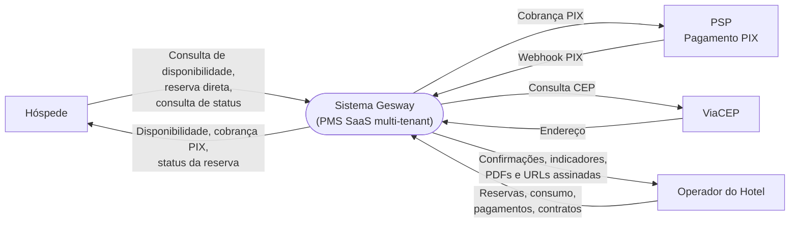
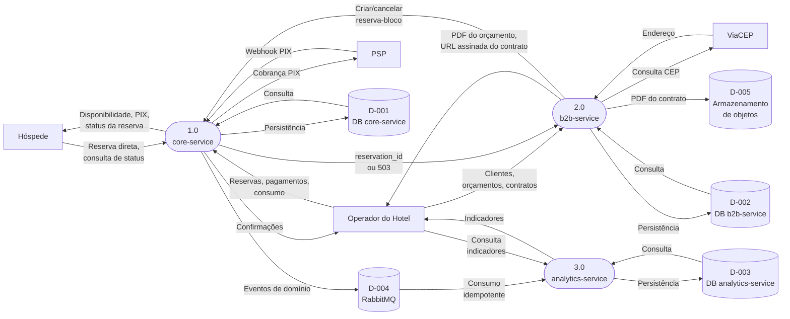
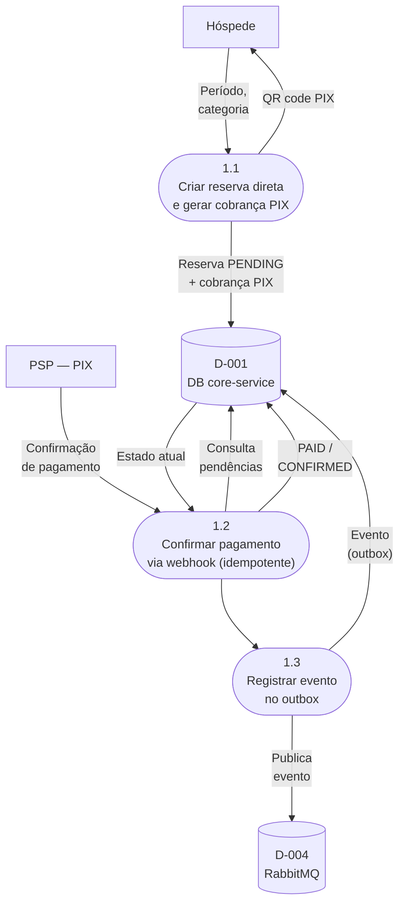
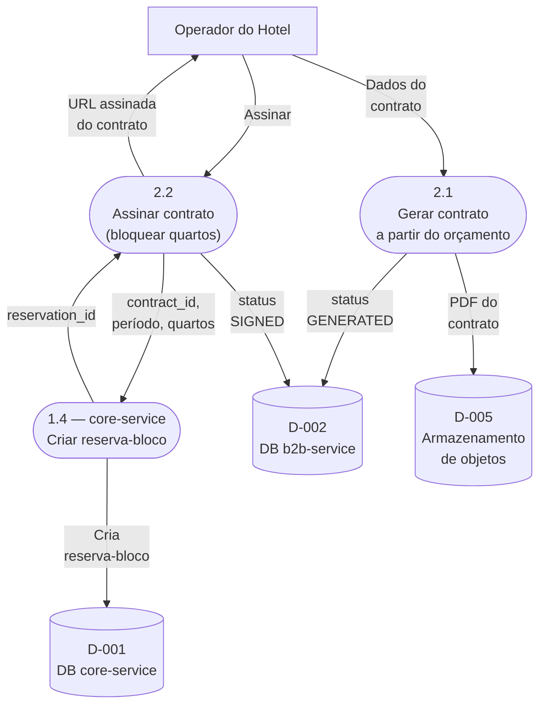

# Diagrama de Fluxo de Dados (DFD)

---

**Projeto:** Gesway — Sistema de Gestão Hoteleira (PMS SaaS) 
**Grupo:** Gesway — Gabriel Reis Cunha (6325149) 
· Sirlande Martins (6325269) 
· Weslley Lucas (6325226) 
**Data:** 21/09/2026 
**Versão:** 1.1

---

## 1. Objetivo

Este documento mapeia como a informação transita pelas fronteiras, processos e armazenamentos do Gesway. O recorte de processos usado aqui **é o da ADR-003** (Documento 07): `core-service`, `b2b-service` e `analytics-service`, delimitados pelo critério de consistência transacional, não pelo tipo de dado.

### Natureza normativa deste documento

O DFD é **norma**, não relato: declara como a informação *deve* transitar no sistema, e é contra ele que a implementação será conferida. Por isso os processos, armazenamentos e fluxos descritos abaixo não carregam status de implementação — marcá-los faria o documento envelhecer a cada commit e trocaria o papel dele, que é definir o alvo.

O acompanhamento de execução — o que já foi construído, por quem e em qual sprint — é responsabilidade do **Documento 08 — Planejamento de Sprints e Tarefas**. A mesma separação vale no Documento 02 (§1), e é a razão pela qual nenhum dos dois traz coluna de status.

A exceção são as **entidades de dados**, que herdam do Documento 04 (MER) a legenda de status citada na Seção 2 — ali o status é atributo da própria entidade, não deste documento.

> **Nota de rastreabilidade.** O Documento 02 (coluna "Módulo") e a Seção 7 do Documento 04 (MER) ainda referem-se ao recorte proposto em 23/08/2026 (`core`, `billing`, `analytics`, dividido por tipo de dado), que a ADR-003 substituiu formalmente. Este documento usa o recorte vigente; a atualização das referências cruzadas em Doc. 02 e Doc. 04 §7 é pendência a resolver antes da entrega final.

> **Dependência de entrega.** Este documento se apoia na ADR-003, registrada no Documento 07. Os dois precisam ser entregues juntos — e o Documento 07 primeiro —, sob pena de o DFD citar como fundamento uma decisão ausente do repositório oficial.

---

## 2. Notação Utilizada

| Forma no diagrama | Elemento | Exemplo |
|---|---|---|
| Retângulo | Entidade externa — ator ou sistema fora da fronteira do Gesway | Hóspede, PSP |
| Estádio (cantos arredondados) | Processo — transforma dados | 1.0 core-service |
| Cilindro | Armazenamento — banco de dados, fila de mensagens ou armazenamento de objetos | D-001 DB core-service |
| Seta rotulada | Fluxo de dados — a ponta indica a direção da informação | Webhook PIX |

As três formas mantêm entidade externa, processo e armazenamento visualmente distintos, o que o modelo genérico não fazia: ele empregava o mesmo cilindro para entidade externa e para banco de dados.

**Status de entidade:** nas tabelas das Seções 4 e 7, os marcadores seguem a legenda do Documento 04, Seção 1.1 — 🔷 **Planejada** (desenho fechado, implementação pendente) e ⚠️ **Em transição** (implementada, com substituição já decidida). Entidade sem marcador está implementada.

---

## 3. DFD Nível 0 — Diagrama de Contexto

**Entidades externas:**

| Entidade | Papel | Requisitos |
|---|---|---|
| Hóspede | Consulta disponibilidade, cria reserva direta com sinal via PIX e acompanha o status da própria reserva, sem login | RF-024 a RF-028 |
| Operador do Hotel | Administrador, Recepcionista ou Garçom, autenticado via `app-pms` | RF-001 a RF-023, RF-029 a RF-043, RF-045 a RF-056 |
| PSP (Provedor de Pagamento PIX) | Sistema externo que processa a cobrança e confirma via *webhook* | RF-026, RF-027, RNF-012 |
| ViaCEP | Preenchimento automático de endereço no cadastro de cliente corporativo | RF-045 |

> O hóspede **não** informa ao sistema que pagou: ele paga no aplicativo do próprio banco, e a confirmação chega pelo *webhook* do PSP (RF-027). É por isso que a confirmação de pagamento parte do PSP, e não do hóspede.

---

## 4. DFD Nível 1 — Processos Principais (Microsserviços)

**Processos:**

| ID | Processo | Entidades (ADR-003) | Requisitos |
|---|---|---|---|
| 1.0 | core-service | TENANTS, USERS, ROOM_CATEGORIES, ROOMS, GUESTS, RESERVATIONS, RESERVATION_ROOMS, PAYMENTS, CONSUMPTIONS ⚠️, PRODUCTS 🔷, ACCOUNTS 🔷, ACCOUNT_ITEMS 🔷 | RF-001 a RF-028, RF-055, RF-056 |
| 2.0 | b2b-service | CORPORATE_CLIENTS, EVENT_QUOTES, QUOTE_SERVICES, CONTRACTS, CONTRACT_INSTALLMENTS | RF-029 a RF-036, RF-045 |
| 3.0 | analytics-service | Nenhuma entidade própria — projeções de leitura alimentadas por evento | RF-037 a RF-043 |

> RF-045 (integração ViaCEP) está classificado como módulo `core-service` no Documento 02, mas a entidade que ela alimenta (`CORPORATE_CLIENTS`) pertence ao `b2b-service` desde a ADR-003 — outro ponto da nota de rastreabilidade da Seção 1.

> **Requisitos que não correspondem a um processo deste diagrama.** RF-044 (especificação OpenAPI) é *cross-cutting*: documenta os processos, sem transformar dado de negócio. RF-046 a RF-054 descrevem a aplicação web `app-pms`, que o Documento 02 §2.9 define como o meio pelo qual a operação exerce os demais requisitos e que "não acrescenta regra de negócio própria: toda validação permanece no servidor". Por não transformar dados, a interface não é um processo do DFD — é o canal pelo qual a entidade externa **Operador do Hotel** troca informação com o sistema. Sua decomposição em contêineres é tratada no Documento 06 (C4 Model).

---

## 5. DFD Nível 2 — Detalhamento de Processos

Subprocessos detalhados nesta seção:

| ID | Subprocesso | Processo pai |
|---|---|---|
| 1.1 | Criar reserva direta e gerar cobrança PIX | 1.0 core-service |
| 1.2 | Confirmar pagamento via *webhook* | 1.0 core-service |
| 1.3 | Registrar evento no *outbox* | 1.0 core-service |
| 1.4 | Criar reserva-bloco do contrato | 1.0 core-service |
| 2.1 | Gerar contrato a partir do orçamento | 2.0 b2b-service |
| 2.2 | Assinar contrato | 2.0 b2b-service |

### 5.1 Detalhamento do Processo 1.0 — Reserva Direta com Confirmação PIX (RF-026, RF-027)

A assinatura do *webhook* é verificada em 1.2 **antes de qualquer efeito colateral** (RNF-012): requisição sem assinatura válida é recusada com `401` e não chega ao banco. Reprocessar o mesmo `provider_charge_id` não duplica efeito (RF-027). O evento só é publicado depois de gravado no *outbox*, na mesma transação da mudança de estado — se o RabbitMQ estiver fora do ar, o evento aguarda no banco (ver ADR-003, tabela de indisponibilidade).

### 5.2 Detalhamento dos Processos 2.0 e 1.0 — Assinatura de Contrato B2B (RF-033)

O contrato só muda de status depois da resposta do `core-service` (ADR-003). Se o `core-service` estiver indisponível, `b2b-service` recusa a assinatura com `503`, mantendo o contrato no status anterior — sem estado parcial.

---

## 6. Dicionário de Fluxos de Dados

| ID Fluxo | Nome | Origem | Destino | Descrição | Formato |
|----------|------|--------|---------|-----------|---------|
| F-001 | Credenciais | Operador do Hotel | core-service | E-mail e senha para login (RF-002) | JSON |
| F-002 | Token JWT | core-service | Operador do Hotel | `{userId, role, tenantId}`, validade ≤ 8h (RNF-005) | Bearer Token |
| F-003 | Consulta de disponibilidade | Hóspede | core-service | Período e categoria desejada (RF-025) | HTTP GET (*querystring*) |
| F-004 | Reserva direta | Hóspede | core-service | Dados do hóspede + período; dispara criação de reserva e cobrança PIX (RF-026) | JSON |
| F-005 | Cobrança PIX | core-service | Hóspede | QR code (EMV) e validade da cobrança | JSON |
| F-006 | Webhook de confirmação PIX | PSP | core-service | `provider_charge_id` e status; assinatura verificada antes de qualquer efeito (RNF-012) | JSON (HTTP POST) |
| F-007 | Lançamento de consumo | Operador (Garçom) | core-service | Item da comanda com `client_item_id` para idempotência offline (RF-023) | JSON |
| F-008 | Fechamento de conta | core-service | Operador | Total combinando diárias e consumos (RF-016) | JSON |
| F-009 | Cadastro de cliente corporativo | Operador | b2b-service | Dados do cliente, com CEP a preencher (RF-029) | JSON |
| F-010 | Consulta de CEP | b2b-service | ViaCEP | CEP informado no cadastro (RF-045) | HTTP GET |
| F-011 | Endereço | ViaCEP | b2b-service | Logradouro, bairro, cidade, UF | JSON |
| F-012 | Orçamento de evento | Operador | b2b-service | Período, pessoas, serviços adicionais (RF-030, RF-031) | JSON |
| F-013 | Entrega do orçamento e do contrato | b2b-service | Operador | Orçamento gerado sob demanda (RF-032); contrato entregue por URL assinada com expiração ≤ 5 min (RF-035, RNF-023) | PDF / URL assinada |
| F-014 | Criar/cancelar reserva-bloco | b2b-service | core-service | `contract_id`, período, quartos — REST síncrono, idempotente (ADR-003) | JSON (HTTP interno) |
| F-015 | Confirmação da reserva-bloco | core-service | b2b-service | `reservation_id` ou erro `503` | JSON |
| F-016 | Evento de domínio | core-service | RabbitMQ (D-004) | Criação/alteração/remoção de hotel, quarto, hóspede, reserva, pagamento — sempre com `tenant_id` (ADR-003) | Evento (JSON, outbox) |
| F-017 | Consumo de evento | RabbitMQ (D-004) | analytics-service | Entrega pelo menos uma vez; consumidor idempotente, com fila de mensagens mortas | Evento (JSON) |
| F-018 | Consulta de indicadores | Operador | analytics-service | Ocupação, receita, sazonalidade, alertas, ranking (RF-037 a RF-043) | HTTP GET (*querystring*) |
| F-019 | Consulta de status da reserva | Hóspede | core-service | Identificador da reserva, sem autenticação; devolve a situação da reserva e do pagamento (RF-028) | HTTP GET |
| F-020 | PDF do contrato | b2b-service | Armazenamento de objetos (D-005) | Arquivo persistido na geração do contrato. O *download* é feito pelo operador direto do armazenamento, com a URL assinada de F-013 — o arquivo não volta a passar pelo `b2b-service` (RF-035, RNF-023) | PDF |

---

## 7. Dicionário de Armazenamentos

| ID | Nome | Tipo | Descrição | Microsserviço Responsável |
|----|------|------|-----------|---------------------------|
| D-001 | DB core-service | PostgreSQL 17 | TENANTS, USERS, ROOM_CATEGORIES, ROOMS, GUESTS, RESERVATIONS, RESERVATION_ROOMS, PAYMENTS, CONSUMPTIONS ⚠️, PRODUCTS 🔷, ACCOUNTS 🔷, ACCOUNT_ITEMS 🔷. Contém a constraint `EXCLUDE USING gist` anti-*double-booking* e o *outbox* transacional | core-service |
| D-002 | DB b2b-service | PostgreSQL 17 | CORPORATE_CLIENTS, EVENT_QUOTES, QUOTE_SERVICES, CONTRACTS, CONTRACT_INSTALLMENTS. `tenant_id` e `contracts.reservation_id` guardados como identificadores, sem chave estrangeira para o `core-service` | b2b-service |
| D-003 | DB analytics-service | PostgreSQL 17 | Sem entidade de domínio própria — projeções de leitura alimentadas por evento, identificadas pelos mesmos `id`/`tenant_id` do núcleo, sem chave estrangeira | analytics-service |
| D-004 | RabbitMQ (eventos de domínio) | Message Broker | *Exchange* alimentada pelo publicador do *outbox* do `core-service`; fila durável com fila de mensagens mortas (DLQ) consumida pelo `analytics-service` | core-service (produtor) / analytics-service (consumidor) |
| D-005 | Armazenamento de objetos | Armazenamento de objetos (S3/MinIO) | PDF de contrato, que contém dado pessoal e por isso nunca fica acessível por URL pública permanente: o acesso se dá por URL assinada com expiração ≤ 5 minutos (RNF-023). O PDF de orçamento é gerado sob demanda e não é armazenado | b2b-service |

---

## 8. Histórico de Revisões

| Versão | Data | Autor | Descrição da Alteração |
|--------|------|-------|------------------------|
| 1.0 | 17/09/2026 | Sirlande Martins | Versão inicial, derivada do recorte de serviços da **ADR-003** (Doc. 07): `core-service`, `b2b-service`, `analytics-service`. Nível 0 (contexto), Nível 1 (processos/microsserviços) e Nível 2 (reserva direta + PIX; assinatura de contrato B2B), com dicionários de fluxo e de armazenamento. Aponta pendência: Doc. 02 (coluna "Módulo") e Doc. 04 §7 ainda refletem a proposta de 23/08/2026, substituída pela ADR-003 |
| 1.1 | 21/09/2026 | Sirlande Martins | Declarada a natureza normativa do documento (§1), alinhada à do Doc. 02. Notação da §2 alinhada ao modelo oficial — entidade externa em retângulo, processo em estádio, armazenamento em cilindro —, preservando as três formas distintas. Corrigido o Nível 0: a confirmação do pagamento parte do PSP, não do hóspede, e a consulta pública de status (RF-028) passa a constar dos diagramas e do dicionário (F-019). Acrescentados o armazenamento de objetos (D-005) e a persistência do PDF de contrato (F-020), exigidos por RF-035 e RNF-023. Justificada a ausência de processo para RF-044 e RF-046 a RF-054 (§4). Numerado o subprocesso 1.4, antes indefinido, e acrescentada a lista de subprocessos (§5). CONSUMPTIONS marcada como ⚠️ em transição, conforme o Doc. 04. Registrada a dependência de entrega conjunta com o Doc. 07 |

---

**Aprovado por:**

___________________________________________________
Professor(a) Orientador(a)

Data: ___/___/2026
