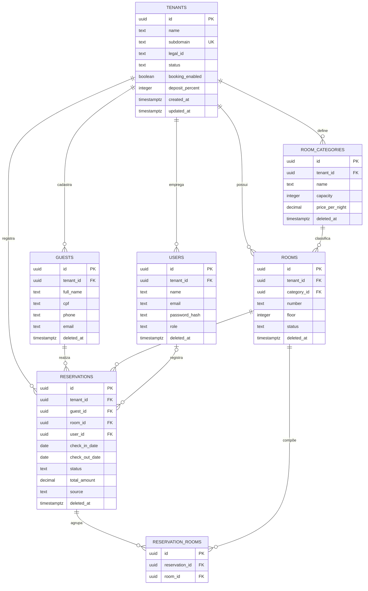
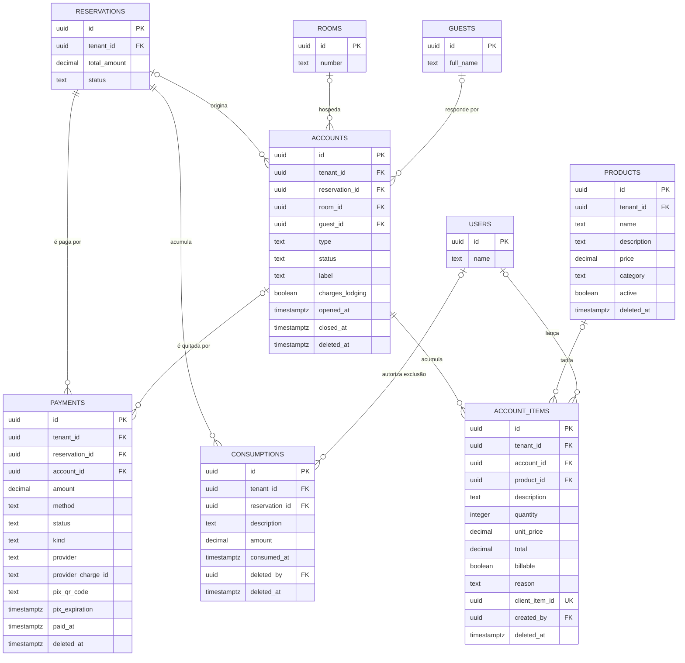
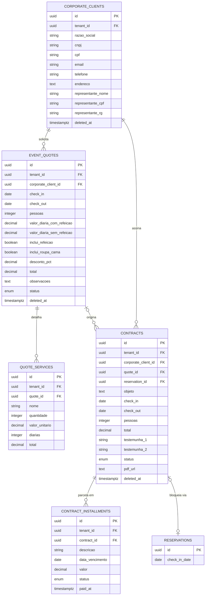

# Modelo Entidade-Relacionamento (MER)

---

**Projeto:** Gesway — Sistema de Gestão Hoteleira (PMS SaaS)
**Grupo:** Gesway — Gabriel Reis Cunha (6325149)
· Sirlande Martins (6325269)
· Weslley Lucas (6325226)
**Data:** 14/09/2026
**Versão:** 1.2

---

## 1. Objetivo

Este documento apresenta a modelagem estrutural de dados do sistema, detalhando as entidades, seus atributos, relacionamentos e cardinalidades. O modelo serve como base para a implementação do banco de dados.

O modelo descreve o **alvo arquitetural do projeto** — o conjunto completo de entidades necessárias para a solução, incluindo as já implementadas e as já especificadas mas ainda não construídas. São **17 entidades**: 15 implementadas e 2 planejadas.

> **Correção desta versão:** a checagem contra `services/core-service/app/Models/` e `services/core-service/db/schema.sql` do repositório **atual** de implementação, em 14/09/2026, mostrou que `PRODUCTS` (§4.10) possui `Model`, tabela e testes automatizados — a versão 1.1 o havia rebaixado a 🔷 Planejado com base numa cópia defasada do repositório. O status foi restabelecido para ✅ Implementado, e o `role` de `USERS` (§4.2) passou a incluir `WAITER`, já presente na constraint do banco. Os identificadores `RF-xxx` seguem alinhados ao Documento 02, fonte de verdade da numeração.

A base implementada foi extraída dos *models* Sequelize (`services/core-service/app/Models/`) e do script de criação (`services/core-service/db/schema.sql`) do repositório. As entidades planejadas têm desenho fechado, registrado em decisão de arquitetura datada.

### 1.1 Legenda de Status

| Status | Significado | Política de alteração |
|--------|-------------|----------------------|
| ✅ **Implementado** | Entidade existe no banco, com testes automatizados cobrindo suas regras | Alteração exige **nova versão deste documento**, aprovada pelo orientador |
| 🔷 **Planejado** | Desenho fechado e datado, implementação pendente | Ajuste de atributos permitido até a implementação, registrado no Histórico de Revisões (Seção 10) |
| ⚠️ **Em transição** | Implementado, porém com substituição já decidida | Será removido em versão futura; não deve receber novas dependências |

### 1.2 Rastreabilidade de Requisitos

Este documento adota identificadores rastreáveis, referenciados pelo Documento de Requisitos (02) e pelo Registro de Decisões Arquitetônicas (07):

| Prefixo | Tipo | Exemplo |
|---------|------|---------|
| `RF-xxx` | Requisito Funcional atendido pela entidade | RF-010 — Registrar reserva |
| `RN-xxx` | Regra de Negócio garantida no nível do banco | RN-003 — Anti-*double-booking* |
| `ADR-xxx` | Decisão arquitetônica que originou a estrutura | ADR-002 — Escolha do banco |

---

## 1.3 Índice de Entidades

| # | Entidade | Status | Módulo | Requisitos |
|---|----------|--------|--------|-----------|
| 4.1 | TENANTS | ✅ Implementado | Núcleo | RF-001, RF-003, RF-005 |
| 4.2 | USERS | ✅ Implementado | Núcleo | RF-002, RF-004 |
| 4.3 | ROOM_CATEGORIES | ✅ Implementado | Hospedagem | RF-006 |
| 4.4 | ROOMS | ✅ Implementado | Hospedagem | RF-007, RF-008 |
| 4.5 | GUESTS | ✅ Implementado | Hospedagem | RF-009 |
| 4.6 | RESERVATIONS | ✅ Implementado | Hospedagem | RF-010 … RF-012 |
| 4.7 | RESERVATION_ROOMS | ✅ Implementado | Hospedagem | RF-013 |
| 4.8 | PAYMENTS | ✅ Implementado | Financeiro | RF-014 … RF-016 |
| 4.9 | CONSUMPTIONS | ⚠️ Em transição | Financeiro | RF-017 |
| 4.10 | PRODUCTS | ✅ Implementado | Consumo (F&B) | RF-018 |
| 4.11 | **ACCOUNTS** | 🔷 **Planejado** | Consumo (F&B) | RF-019 … RF-022 |
| 4.12 | **ACCOUNT_ITEMS** | 🔷 **Planejado** | Consumo (F&B) | RF-022, RF-023 |
| 4.13 | CORPORATE_CLIENTS | ✅ Implementado | B2B | RF-029 |
| 4.14 | EVENT_QUOTES | ✅ Implementado | B2B | RF-030, RF-032 |
| 4.15 | QUOTE_SERVICES | ✅ Implementado | B2B | RF-031 |
| 4.16 | CONTRACTS | ✅ Implementado | B2B | RF-033 … RF-035 |
| 4.17 | CONTRACT_INSTALLMENTS | ✅ Implementado | B2B | RF-036 |

> Os identificadores `RF-xxx` serão detalhados no **Documento 02 — Requisitos Funcionais e Não Funcionais**. Esta tabela estabelece a âncora de rastreabilidade entre modelo de dados e requisitos.

---

## 2. Justificativa da Escolha do Banco de Dados

| Critério | Análise |
|----------|---------|
| **Tipo escolhido** | [X] Relacional (SQL) / [ ] Não Relacional (NoSQL) / [ ] Ambos (polyglot persistence) |
| **Tecnologia** | PostgreSQL 17 |
| **Volume de dados esperado** | Baixo a médio. Por hotel: 5–80 quartos, ~200–2.000 reservas/ano, ~10.000 lançamentos de consumo/ano. Multi-tenant: dezenas a centenas de hotéis na mesma base |
| **Padrão de acesso** | Balanceado com viés de leitura. Escrita concentrada em reservas, pagamentos e consumo; leitura intensa no mapa de reservas (*rack*) e nos relatórios analíticos |
| **Consistência vs. Disponibilidade** | **ACID obrigatório.** O domínio é financeiro (pagamentos, fechamento de conta) e possui invariantes rígidas (um quarto não pode ter duas reservas sobrepostas). *Eventual consistency* é inaceitável no núcleo transacional |
| **Formato dos dados** | Estruturado e fortemente relacional — entidades com vínculos bem definidos e cardinalidades estáveis |
| **Escalabilidade** | Vertical no núcleo transacional; carga analítica isolada no banco próprio do `analytics-service`, alimentado por eventos do núcleo (ADR-003) |

**Justificativa resumida:**

O domínio hoteleiro é intrinsecamente relacional e transacional. Uma reserva conecta simultaneamente hóspede, quarto, categoria, usuário responsável e tenant; um check-out precisa somar diárias e consumos e registrar pagamento de forma atômica. Modelar isso em um banco não relacional exigiria duplicar dados entre documentos e implementar consistência na aplicação — trocando garantias que o SGBD oferece de graça por código sujeito a erro em um domínio onde erro significa cobrança indevida.

A escolha do PostgreSQL, especificamente, vai além do fato de ser relacional. Três recursos dele resolvem problemas concretos deste projeto. O primeiro é a constraint `EXCLUDE USING gist` combinada com o tipo `daterange`, que impede **fisicamente** que o mesmo quarto tenha duas reservas com datas sobrepostas — a regra mais crítica do negócio deixa de depender exclusivamente da lógica de aplicação e passa a ser garantida pelo banco, mesmo diante de condição de corrida ou falha no código. O segundo é o suporte nativo a `UUID` como chave primária, adotado em todas as tabelas: em um SaaS multi-tenant, identificadores sequenciais expõem volume de negócio e facilitam enumeração indevida entre inquilinos. O terceiro são os **índices parciais**, usados para que o *soft delete* funcione corretamente com restrições de unicidade — sem eles, um registro excluído logicamente continuaria ocupando seu identificador único para sempre.

O modelo multi-tenant adotado é o de **schema compartilhado com discriminador**: todas as tabelas de negócio carregam `tenant_id` como chave estrangeira obrigatória, e toda consulta filtra por esse campo. A alternativa (um schema ou banco por hotel) foi descartada por multiplicar o custo operacional de *migrations* e monitoramento sem ganho proporcional na faixa de volume esperada. Por fim, o histórico é preservado por meio de *soft delete* (`deleted_at`) em vez de exclusão física, exigência prática de um sistema com natureza contábil.

---

## 3. Diagrama Entidade-Relacionamento (DER)

### 3.1 Diagrama Conceitual

> O diagrama está segmentado em três blocos por legibilidade. O vínculo entre eles é `TENANTS`, raiz de todo o modelo multi-tenant.

**Bloco 1 — Núcleo operacional (hospedagem)**



**Bloco 2 — Financeiro e consumo (F&B)**

> Inclui as entidades planejadas `ACCOUNTS` e `ACCOUNT_ITEMS`, que completam o módulo de comanda.



> **Nota sobre a transição:** `CONSUMPTIONS` (⚠️ em transição) e `ACCOUNT_ITEMS` (🔷 planejado) resolvem o mesmo problema e **não coexistirão**. Ao implementar o módulo de comanda, os registros de `consumptions` migram para `account_items` e a tabela é descontinuada. Ela permanece neste documento por estar em produção — ver Seção 9.

**Bloco 3 — B2B (grupos, orçamentos e contratos)**



---

## 4. Dicionário de Dados

> Convenções gerais: toda PK é `UUID` gerado por `uuid_generate_v4()`. Toda tabela de negócio possui `tenant_id` (FK para `tenants`) obrigatório — é o discriminador de isolamento multi-tenant. `created_at` e `updated_at` são `TIMESTAMPTZ DEFAULT now()`. `deleted_at` indica *soft delete* quando presente.

### 4.1 Entidade: TENANTS ✅

> **Status:** Implementado · **Requisitos:** RF-001, RF-003, RF-005

Raiz do modelo SaaS. Cada registro é um hotel ou pousada cliente da plataforma.

| Atributo | Tipo | Nulo? | Restrição | Descrição |
|----------|------|-------|-----------|-----------|
| id | UUID | Não | PK | Identificador único |
| name | TEXT | Não | - | Nome do hotel |
| subdomain | TEXT | Não | UNIQUE | Identificador na URL pública de reservas |
| legal_id | TEXT | Sim | - | CNPJ ou documento fiscal |
| status | TEXT | Não | DEFAULT 'ACTIVE'; CHECK IN ('ACTIVE','SUSPENDED') | Situação da assinatura |
| booking_enabled | BOOLEAN | Não | DEFAULT true | Liga/desliga o motor de reserva direta |
| deposit_percent | INTEGER | Não | DEFAULT 30; CHECK 0–100 | Percentual cobrado como sinal PIX |
| created_at / updated_at | TIMESTAMPTZ | Não | DEFAULT now() | Auditoria temporal |

### 4.2 Entidade: USERS ✅

> **Status:** Implementado · **Requisitos:** RF-002, RF-004

Funcionários do hotel com acesso ao sistema.

| Atributo | Tipo | Nulo? | Restrição | Descrição |
|----------|------|-------|-----------|-----------|
| id | UUID | Não | PK | |
| tenant_id | UUID | Não | FK → tenants ON DELETE CASCADE | Isolamento multi-tenant |
| name | TEXT | Não | - | Nome do funcionário |
| email | TEXT | Não | UNIQUE (tenant_id, email) | Login — único por hotel, não global |
| password_hash | TEXT | Não | - | Hash bcrypt; senha nunca em texto claro |
| role | TEXT | Não | DEFAULT 'RECEPTIONIST'; CHECK IN ('ADMIN','RECEPTIONIST','WAITER') | Perfil de acesso |
| deleted_at | TIMESTAMPTZ | Sim | - | *Soft delete* |

### 4.3 Entidade: ROOM_CATEGORIES ✅

> **Status:** Implementado · **Requisitos:** RF-006

Tipos de acomodação (Standard, Luxo, Suíte) com capacidade e tarifa.

| Atributo | Tipo | Nulo? | Restrição | Descrição |
|----------|------|-------|-----------|-----------|
| id | UUID | Não | PK | |
| tenant_id | UUID | Não | FK → tenants ON DELETE CASCADE | |
| name | TEXT | Não | UNIQUE (tenant_id, name) | Nome da categoria |
| capacity | INTEGER | Não | DEFAULT 1; CHECK > 0 | Número de hóspedes suportados |
| price_per_night | DECIMAL(10,2) | Não | DEFAULT 0; CHECK >= 0 | Tarifa da diária |
| deleted_at | TIMESTAMPTZ | Sim | - | *Soft delete* |

### 4.4 Entidade: ROOMS ✅

> **Status:** Implementado · **Requisitos:** RF-007, RF-008

Unidades físicas de hospedagem.

| Atributo | Tipo | Nulo? | Restrição | Descrição |
|----------|------|-------|-----------|-----------|
| id | UUID | Não | PK | |
| tenant_id | UUID | Não | FK → tenants ON DELETE CASCADE | |
| category_id | UUID | Não | FK → room_categories ON DELETE RESTRICT | Categoria que define tarifa e capacidade |
| number | TEXT | Não | UNIQUE (tenant_id, number) | Identificação do quarto (ex.: "101") |
| floor | INTEGER | Sim | - | Andar |
| status | TEXT | Não | DEFAULT 'AVAILABLE'; CHECK IN ('AVAILABLE','OCCUPIED','MAINTENANCE','CLEANING') | Estado operacional |
| deleted_at | TIMESTAMPTZ | Sim | - | *Soft delete* |

### 4.5 Entidade: GUESTS ✅

> **Status:** Implementado · **Requisitos:** RF-009

Hóspedes cadastrados.

| Atributo | Tipo | Nulo? | Restrição | Descrição |
|----------|------|-------|-----------|-----------|
| id | UUID | Não | PK | |
| tenant_id | UUID | Não | FK → tenants ON DELETE CASCADE | |
| full_name | TEXT | Não | - | Nome completo |
| cpf | TEXT | Sim | UNIQUE (tenant_id, cpf) | Documento. Nulo permitido — o Postgres não considera dois `NULL` como iguais, então vários hóspedes sem CPF coexistem |
| phone | TEXT | Sim | - | Telefone de contato |
| email | TEXT | Sim | UNIQUE (tenant_id, email) | E-mail de contato |
| deleted_at | TIMESTAMPTZ | Sim | - | *Soft delete* |

### 4.6 Entidade: RESERVATIONS ✅

> **Status:** Implementado · **Requisitos:** RF-010 a RF-012 · RN-003

Núcleo transacional do sistema.

| Atributo | Tipo | Nulo? | Restrição | Descrição |
|----------|------|-------|-----------|-----------|
| id | UUID | Não | PK | |
| tenant_id | UUID | Não | FK → tenants ON DELETE CASCADE | |
| guest_id | UUID | Não | FK → guests ON DELETE RESTRICT | Hóspede titular |
| room_id | UUID | Não | FK → rooms ON DELETE RESTRICT | Quarto principal |
| user_id | UUID | **Sim** | FK → users ON DELETE RESTRICT | Recepcionista responsável. Nulo em reservas vindas do motor online, que não têm operador |
| check_in_date | DATE | Não | - | Data de entrada |
| check_out_date | DATE | Não | CHECK check_out_date > check_in_date | Data de saída |
| status | TEXT | Não | DEFAULT 'PENDING'; CHECK IN ('PENDING','CONFIRMED','CHECKED_IN','CHECKED_OUT','CANCELLED') | Máquina de estados da reserva |
| total_amount | DECIMAL(12,2) | Não | DEFAULT 0; CHECK >= 0 | Valor das diárias |
| source | TEXT | Não | DEFAULT 'MANUAL'; CHECK IN ('MANUAL','DIRECT','B2B') | Canal de origem — alimenta relatório por canal |
| deleted_at | TIMESTAMPTZ | Sim | - | *Soft delete* |

**Constraint especial — anti-*double-booking*:**

```sql
EXCLUDE USING gist (
  room_id WITH =,
  daterange(check_in_date, check_out_date, '[)') WITH &&
) WHERE (status <> 'CANCELLED' AND deleted_at IS NULL)
```

Impede, no nível do banco, que o mesmo quarto tenha duas reservas com períodos sobrepostos. O predicado `WHERE` é essencial: sem ele, uma reserva cancelada continuaria bloqueando o quarto naquelas datas indefinidamente.

### 4.7 Entidade: RESERVATION_ROOMS *(tabela pivô)* ✅

> **Status:** Implementado · **Requisitos:** RF-013

Relação N:N que permite uma reserva ocupar múltiplos quartos (grupos, famílias).

| Atributo | Tipo | Nulo? | Restrição | Descrição |
|----------|------|-------|-----------|-----------|
| id | UUID | Não | PK | |
| reservation_id | UUID | Não | FK → reservations ON DELETE CASCADE; UNIQUE (reservation_id, room_id) | |
| room_id | UUID | Não | FK → rooms ON DELETE CASCADE | |

### 4.8 Entidade: PAYMENTS ✅

> **Status:** Implementado · **Requisitos:** RF-014 a RF-016

Pagamentos vinculados a reservas, incluindo cobranças PIX online.

| Atributo | Tipo | Nulo? | Restrição | Descrição |
|----------|------|-------|-----------|-----------|
| id | UUID | Não | PK | |
| tenant_id | UUID | Não | FK → tenants ON DELETE CASCADE | |
| reservation_id | UUID | Não | FK → reservations ON DELETE CASCADE | |
| amount | DECIMAL(12,2) | Não | CHECK >= 0 | Valor pago |
| method | TEXT | Não | - | Meio (PIX, CARTAO_CREDITO, DINHEIRO...) |
| status | TEXT | Não | DEFAULT 'PAID'; CHECK IN ('PENDING','PAID','EXPIRED','FAILED') | Pagamento manual nasce `PAID`; PIX nasce `PENDING` e vira `PAID` via *webhook* |
| kind | TEXT | Não | DEFAULT 'FULL'; CHECK IN ('FULL','DEPOSIT','BALANCE') | Natureza: integral, sinal ou saldo |
| provider | TEXT | Sim | - | Provedor de pagamento (PSP) |
| provider_charge_id | TEXT | Sim | - | Identificador da cobrança no PSP |
| pix_qr_code | TEXT | Sim | - | *Payload* PIX copia-e-cola (EMV) |
| pix_expiration | TIMESTAMPTZ | Sim | - | Validade da cobrança |
| paid_at | TIMESTAMPTZ | Sim | DEFAULT NULL | Momento da confirmação |
| deleted_at | TIMESTAMPTZ | Sim | - | *Soft delete* |

### 4.9 Entidade: CONSUMPTIONS ⚠️

> **Status: Em transição** · **Requisitos:** RF-017 (lançamento/estorno com auditoria — ver também RN-007/RN-008 em `ACCOUNT_ITEMS`)
> Será **substituída por `ACCOUNT_ITEMS`** (4.12). Decisão registrada em 07/08/2026 — as duas
> resolvem o mesmo problema e não podem coexistir. Documentada aqui por estar em produção.
> **Não deve receber novas dependências.**

Consumos extras lançados na reserva (frigobar, restaurante, spa).

| Atributo | Tipo | Nulo? | Restrição | Descrição |
|----------|------|-------|-----------|-----------|
| id | UUID | Não | PK | |
| tenant_id | UUID | Não | FK → tenants ON DELETE CASCADE | |
| reservation_id | UUID | Não | FK → reservations ON DELETE CASCADE | |
| description | TEXT | Não | - | Descrição do item consumido |
| amount | DECIMAL(12,2) | Não | CHECK >= 0 | Valor |
| consumed_at | TIMESTAMPTZ | Não | DEFAULT now() | Momento do consumo |
| deleted_by | UUID | Sim | FK → users | **Trilha de auditoria financeira** — registra quem autorizou o estorno |
| deleted_at | TIMESTAMPTZ | Sim | - | *Soft delete* |

### 4.10 Entidade: PRODUCTS ✅

> **Status:** implementado — `Model`, tabela em `services/core-service/db/schema.sql` e testes automatizados, verificados contra o
> repositório atual em 14/09/2026. Restabelecido na v1.2, após rebaixamento indevido na v1.1. · **Requisitos:** RF-018

Catálogo de itens do cardápio (bebidas, comidas, serviços).

| Atributo | Tipo | Nulo? | Restrição | Descrição |
|----------|------|-------|-----------|-----------|
| id | UUID | Não | PK | |
| tenant_id | UUID | Não | FK → tenants ON DELETE CASCADE | |
| name | TEXT | Não | UNIQUE PARCIAL (tenant_id, name) WHERE deleted_at IS NULL | Nome do item |
| description | TEXT | Sim | - | Descrição opcional |
| price | DECIMAL(10,2) | Não | DEFAULT 0; CHECK >= 0 | Preço unitário |
| category | TEXT | Não | DEFAULT 'OTHER'; CHECK IN ('FOOD','DRINK','SERVICE','OTHER') | Categoria. `SERVICE` cobre itens não consumíveis (*day-use*, sonorização) |
| active | BOOLEAN | Não | DEFAULT true | Desativar remove do cardápio sem apagar histórico |
| deleted_at | TIMESTAMPTZ | Sim | - | *Soft delete* |

> **Índice parcial:** a unicidade de `name` só se aplica a registros vivos. Sem o filtro `WHERE deleted_at IS NULL`, um produto excluído reservaria seu nome permanentemente, impedindo recriação.

### 4.11 Entidade: ACCOUNTS 🔷 *Planejado*

> **Status:** desenho fechado em 07/08/2026. Implementação prevista na Sprint do módulo de comanda.
> **Requisitos:** RF-019 (conta por estadia) · RF-020 (*day-use*) · RF-021 (conta dividida) · RF-022 (consumo interno)

Conta/comanda — abstração central do módulo de consumo. Substitui o vínculo rígido "consumo pertence a uma reserva", permitindo quatro cenários operacionais que o modelo atual não suporta.

| Atributo | Tipo | Nulo? | Restrição | Descrição |
|----------|------|-------|-----------|-----------|
| id | UUID | Não | PK | |
| tenant_id | UUID | Não | FK → tenants ON DELETE CASCADE | |
| type | TEXT | Não | CHECK IN ('ROOM','DAY_USE','TABLE','DIRECT','INTERNAL') | Natureza da conta — ver tabela de cenários abaixo |
| status | TEXT | Não | DEFAULT 'OPEN'; CHECK IN ('OPEN','CLOSED','PAID') | Ciclo de vida |
| reservation_id | UUID | **Sim** | FK → reservations ON DELETE RESTRICT | **Nulo em `DAY_USE` e `INTERNAL`** — é o que viabiliza consumo sem hospedagem |
| room_id | UUID | Sim | FK → rooms ON DELETE RESTRICT | Quarto vinculado, quando aplicável |
| guest_id | UUID | Sim | FK → guests ON DELETE RESTRICT | Responsável pela conta. Nulo em mesa avulsa e conta interna |
| label | TEXT | Não | - | Identificação operacional: "Suíte 201 — João", "Mesa 5", "Piscina — Ana" |
| charges_lodging | BOOLEAN | Não | DEFAULT true | **Define qual conta carrega a diária** quando há divisão — ver RN-005 |
| opened_at | TIMESTAMPTZ | Não | DEFAULT now() | Abertura |
| closed_at | TIMESTAMPTZ | Sim | - | Fechamento |
| deleted_at | TIMESTAMPTZ | Sim | - | *Soft delete* |

**Cenários operacionais cobertos por `type`:**

| `type` | Cenário | `reservation_id` | `guest_id` |
|--------|---------|------------------|------------|
| `ROOM` | Família hospedada consome na conta da suíte | Preenchido | Preenchido |
| `DAY_USE` | Cliente sem hospedagem almoça e usa a estrutura | **Nulo** | Opcional |
| `TABLE` | Mesa do restaurante aberta ao público | **Nulo** | Nulo |
| `DIRECT` | Venda avulsa (balcão) | **Nulo** | Opcional |
| `INTERNAL` | Refeição de funcionário, perda, quebra | **Nulo** | **Nulo** |

**RN-005 — Rateio da diária na conta dividida:** quando duas ou mais contas compartilham o mesmo `room_id`, **apenas uma** pode ter `charges_lodging = true`. Sem essa regra, a diária seria cobrada em duplicidade ou não seria cobrada de ninguém. Numa reserva com vários quartos, cada conta cobra a diária **do seu próprio quarto**.

**RN-006 — Conta interna nunca é receita:** contas com `type = 'INTERNAL'` são excluídas de qualquer soma de faturamento. Registram custo, não entrada.

---

### 4.12 Entidade: ACCOUNT_ITEMS 🔷 *Planejado*

> **Status:** desenho fechado em 07/08/2026.
> **Requisitos:** RF-023 (lançamento de consumo, idempotência) · RF-022 (cortesia/consumo interno)

Linha de consumo lançada em uma conta. Substitui `CONSUMPTIONS`.

| Atributo | Tipo | Nulo? | Restrição | Descrição |
|----------|------|-------|-----------|-----------|
| id | UUID | Não | PK | |
| tenant_id | UUID | Não | FK → tenants ON DELETE CASCADE | |
| account_id | UUID | Não | FK → accounts ON DELETE CASCADE | Conta que recebe o lançamento |
| product_id | UUID | Sim | FK → products ON DELETE RESTRICT | Item do catálogo. **Nulo** permite lançamento avulso, fora do cardápio |
| description | TEXT | Não | - | Descrição. Copiada do produto quando `product_id` presente |
| quantity | INTEGER | Não | CHECK > 0 | Quantidade |
| unit_price | DECIMAL(10,2) | Não | CHECK >= 0 | Preço unitário no momento do lançamento (**não** referência ao catálogo — preserva o histórico se o preço mudar depois) |
| total | DECIMAL(10,2) | Não | CHECK >= 0 | `quantity × unit_price`, **sempre calculado no servidor** |
| billable | BOOLEAN | Não | DEFAULT true | `false` = não soma no total da conta. Ver RN-007 |
| reason | TEXT | Sim | CHECK IN ('COURTESY','STAFF','LOSS','INTERNAL_USE') | **Obrigatório quando `billable = false`** |
| client_item_id | UUID | Sim | UNIQUE (tenant_id, client_item_id) | Identificador gerado no dispositivo do garçom — garante **idempotência** da fila offline. Ver RN-008 |
| created_by | UUID | Não | FK → users ON DELETE RESTRICT | Quem lançou — trilha de auditoria |
| deleted_at | TIMESTAMPTZ | Sim | - | *Soft delete* |

**RN-007 — Cortesia é registrada, não apagada:** um item marcado `billable = false` mantém `unit_price` e `total` preenchidos normalmente. O valor **não entra** no total da conta, mas **fica registrado** — é o que permite responder "quanto o hotel deu de cortesia neste mês?". Apagar o valor destruiria a informação gerencial.

**RN-008 — Idempotência do lançamento offline:** o aplicativo do garçom opera em rede instável. Cada lançamento carrega um `client_item_id` gerado localmente; reenvios do mesmo identificador não duplicam o item. Sem isso, uma reconexão cobraria o hóspede duas vezes.

**Alteração associada em PAYMENTS:** para que uma conta *day-use* possa ser paga sem reserva, `payments.reservation_id` passa a aceitar nulo e a tabela ganha `account_id`, com a restrição `CHECK (reservation_id IS NOT NULL OR account_id IS NOT NULL)` — todo pagamento pertence a uma reserva **ou** a uma conta.

---

### 4.13 Entidade: CORPORATE_CLIENTS ✅

> **Status:** Implementado · **Requisitos:** RF-029

Clientes pessoa jurídica (igrejas, empresas, escolas) que contratam grupos e eventos.

| Atributo | Tipo | Nulo? | Restrição | Descrição |
|----------|------|-------|-----------|-----------|
| id | UUID | Não | PK | |
| tenant_id | UUID | Não | FK → tenants ON DELETE CASCADE | |
| razao_social | VARCHAR | Não | - | Razão social ou nome da organização |
| cnpj | VARCHAR(14) | Sim | UNIQUE (tenant_id, cnpj) | Somente dígitos |
| cpf | VARCHAR(11) | Sim | UNIQUE (tenant_id, cpf) | Quando o contratante é pessoa física |
| email / telefone | VARCHAR | Sim | - | Contato |
| endereco | TEXT | Sim | - | Endereço completo |
| representante_nome | VARCHAR | Sim | - | Representante legal — obrigatório para gerar contrato |
| representante_cpf | VARCHAR(11) | Sim | - | Documento do representante |
| representante_rg | VARCHAR | Sim | - | RG do representante |
| deleted_at | TIMESTAMPTZ | Sim | - | *Soft delete* |

### 4.14 Entidade: EVENT_QUOTES ✅

Orçamentos de grupos e eventos.

| Atributo | Tipo | Nulo? | Restrição | Descrição |
|----------|------|-------|-----------|-----------|
| id | UUID | Não | PK | |
| tenant_id | UUID | Não | FK → tenants ON DELETE CASCADE | |
| corporate_client_id | UUID | Não | FK → corporate_clients ON DELETE RESTRICT | |
| check_in / check_out | DATE | Não | CHECK check_out > check_in | Período do evento |
| pessoas | INTEGER | Não | - | Número de participantes |
| valor_diaria_com_refeicao | DECIMAL(10,2) | Sim | - | Tarifa com pensão |
| valor_diaria_sem_refeicao | DECIMAL(10,2) | Sim | - | Tarifa sem pensão |
| inclui_refeicao | BOOLEAN | Não | DEFAULT false | Define qual tarifa aplicar |
| inclui_roupa_cama | BOOLEAN | Não | DEFAULT false | Item adicional |
| desconto_pct | DECIMAL(5,2) | Não | DEFAULT 0 | Percentual de desconto |
| total | DECIMAL(10,2) | Não | - | Valor calculado no servidor |
| observacoes | TEXT | Sim | - | Notas livres |
| status | ENUM | Não | DEFAULT 'SENT'; ('SENT','CONFIRMED','CANCELLED') | Ciclo de vida da proposta |
| deleted_at | TIMESTAMPTZ | Sim | - | *Soft delete* |

### 4.15 Entidade: QUOTE_SERVICES ✅

Serviços adicionais que compõem um orçamento (coffee break, sonorização).

| Atributo | Tipo | Nulo? | Restrição | Descrição |
|----------|------|-------|-----------|-----------|
| id | UUID | Não | PK | |
| tenant_id | UUID | Não | FK → tenants ON DELETE CASCADE | |
| quote_id | UUID | Não | FK → event_quotes ON DELETE CASCADE | |
| nome | VARCHAR | Não | - | Descrição do serviço |
| quantidade | INTEGER | Não | DEFAULT 1 | |
| valor_unitario | DECIMAL(10,2) | Não | - | |
| diarias | INTEGER | Não | DEFAULT 1 | Multiplicador por dia de evento |
| total | DECIMAL(10,2) | Não | - | quantidade × valor_unitario × diarias |

### 4.16 Entidade: CONTRACTS ✅

Contratos jurídicos de grupos e eventos, com PDF gerado.

| Atributo | Tipo | Nulo? | Restrição | Descrição |
|----------|------|-------|-----------|-----------|
| id | UUID | Não | PK | |
| tenant_id | UUID | Não | FK → tenants ON DELETE CASCADE | |
| corporate_client_id | UUID | Não | FK → corporate_clients ON DELETE RESTRICT | Contratante |
| quote_id | UUID | Sim | FK → event_quotes ON DELETE SET NULL | Orçamento de origem |
| reservation_id | UUID | Sim | FK → reservations ON DELETE SET NULL | **Reserva-bloco** criada ao assinar — impede venda avulsa dos quartos no período |
| objeto | TEXT | Não | - | Objeto contratual |
| check_in / check_out | DATE | Não | CHECK check_out > check_in | Período |
| pessoas | INTEGER | Não | - | Participantes |
| total | DECIMAL(10,2) | Não | - | Valor do contrato |
| testemunha_1 / testemunha_2 | VARCHAR | Não | - | Testemunhas exigidas juridicamente |
| status | ENUM | Não | DEFAULT 'GENERATED'; ('GENERATED','SIGNED','CANCELLED') | Ciclo de vida |
| pdf_url | TEXT | Sim | - | URL do PDF no armazenamento de objetos (MinIO) |
| deleted_at | TIMESTAMPTZ | Sim | - | *Soft delete* |

### 4.17 Entidade: CONTRACT_INSTALLMENTS ✅

Parcelamento do contrato.

| Atributo | Tipo | Nulo? | Restrição | Descrição |
|----------|------|-------|-----------|-----------|
| id | UUID | Não | PK | |
| tenant_id | UUID | Não | FK → tenants ON DELETE CASCADE | |
| contract_id | UUID | Não | FK → contracts ON DELETE CASCADE | |
| descricao | VARCHAR | Não | - | Ex.: "Entrada", "Saldo" |
| data_vencimento | DATE | Não | - | Vencimento |
| valor | DECIMAL(10,2) | Não | - | Valor da parcela |
| status | ENUM | Não | DEFAULT 'PENDING'; ('PENDING','PAID') | Baixa da parcela |
| paid_at | TIMESTAMPTZ | Sim | - | Momento da baixa |

---

## 5. Relacionamentos

| Entidade A | Entidade B | Cardinalidade | Descrição |
|-----------|-----------|---------------|-----------|
| TENANTS | USERS | 1:N | Um hotel emprega vários funcionários |
| TENANTS | ROOM_CATEGORIES | 1:N | Um hotel define várias categorias |
| TENANTS | ROOMS | 1:N | Um hotel possui vários quartos |
| TENANTS | GUESTS | 1:N | Um hotel cadastra vários hóspedes |
| TENANTS | RESERVATIONS | 1:N | Um hotel registra várias reservas |
| TENANTS | PAYMENTS / CONSUMPTIONS / PRODUCTS | 1:N | Isolamento multi-tenant em todas as tabelas de negócio |
| TENANTS | CORPORATE_CLIENTS / EVENT_QUOTES / CONTRACTS | 1:N | Idem para o módulo B2B |
| ROOM_CATEGORIES | ROOMS | 1:N | Uma categoria classifica vários quartos |
| GUESTS | RESERVATIONS | 1:N | Um hóspede realiza várias reservas |
| ROOMS | RESERVATIONS | 1:N | Um quarto é reservado em vários períodos |
| USERS | RESERVATIONS | 0..1:N | Reserva online não possui operador |
| **RESERVATIONS** | **ROOMS** | **N:N** | Via `reservation_rooms` — reserva de grupo ocupa vários quartos |
| RESERVATIONS | PAYMENTS | 1:N | Sinal + saldo geram múltiplos pagamentos |
| RESERVATIONS | CONSUMPTIONS | 1:N | Uma estadia acumula vários consumos |
| USERS | CONSUMPTIONS | 0..1:N | Auditoria de estorno via `deleted_by` |
| CORPORATE_CLIENTS | EVENT_QUOTES | 1:N | Um cliente solicita vários orçamentos |
| EVENT_QUOTES | QUOTE_SERVICES | 1:N | Um orçamento detalha vários serviços |
| EVENT_QUOTES | CONTRACTS | 0..1:N | Contrato pode existir sem orçamento prévio |
| CORPORATE_CLIENTS | CONTRACTS | 1:N | Um cliente assina vários contratos |
| CONTRACTS | CONTRACT_INSTALLMENTS | 1:N | Um contrato é parcelado |
| CONTRACTS | RESERVATIONS | 0..1:1 | Reserva-bloco criada na assinatura |
| RESERVATIONS | ACCOUNTS 🔷 | 0..1:N | Uma estadia pode ter várias contas (conta dividida). Conta *day-use* não tem reserva |
| ROOMS | ACCOUNTS 🔷 | 0..1:N | Conta vinculada a um quarto, quando aplicável |
| GUESTS | ACCOUNTS 🔷 | 0..1:N | Responsável pela conta. Nulo em mesa avulsa e conta interna |
| ACCOUNTS 🔷 | ACCOUNT_ITEMS 🔷 | 1:N | Uma conta acumula vários lançamentos |
| PRODUCTS | ACCOUNT_ITEMS 🔷 | 0..1:N | Item do catálogo. Nulo permite lançamento avulso |
| USERS | ACCOUNT_ITEMS 🔷 | 1:N | Quem lançou — auditoria |
| ACCOUNTS 🔷 | PAYMENTS | 0..1:N | Conta *day-use* é quitada sem reserva |

---

## 6. Índices Planejados

| Tabela | Coluna(s) | Tipo | Justificativa |
|--------|-----------|------|---------------|
| tenants | subdomain | UNIQUE | Resolução do hotel na URL pública de reservas |
| users | (tenant_id, email) | UNIQUE | Login — o mesmo e-mail pode existir em hotéis diferentes |
| users | (tenant_id, email) | COMPOSTO | Busca no fluxo de autenticação |
| room_categories | (tenant_id, name) | UNIQUE | Evita categoria duplicada no mesmo hotel |
| rooms | (tenant_id, number) | UNIQUE | Numeração de quarto única por hotel |
| rooms | (tenant_id, status) | COMPOSTO | Consulta de disponibilidade e painel operacional |
| guests | (tenant_id, cpf) | UNIQUE | Evita hóspede duplicado |
| guests | (tenant_id, email) | UNIQUE | Idem |
| reservations | (tenant_id, check_in_date) | COMPOSTO | **Consulta mais crítica** — monta o mapa de reservas por período |
| reservations | (room_id, daterange) | **EXCLUDE gist** | Anti-*double-booking* — ver Seção 4.6 |
| reservation_rooms | reservation_id | COMPOSTO | Expansão dos quartos de uma reserva de grupo |
| products | (tenant_id, name) WHERE deleted_at IS NULL | **UNIQUE PARCIAL** | Unicidade só entre registros vivos |
| event_quotes | corporate_client_id | COMPOSTO | Listagem de orçamentos por cliente |
| quote_services | quote_id | COMPOSTO | Composição do orçamento |
| contracts | corporate_client_id | COMPOSTO | Listagem de contratos por cliente |
| contract_installments | contract_id | COMPOSTO | Parcelas de um contrato |
| accounts 🔷 | (tenant_id, status) | COMPOSTO | **Tela inicial do garçom** — lista de contas abertas |
| accounts 🔷 | reservation_id | COMPOSTO | Contas de uma estadia no fechamento |
| account_items 🔷 | account_id | COMPOSTO | Itens de uma conta |
| account_items 🔷 | (tenant_id, client_item_id) | **UNIQUE** | **Idempotência** do lançamento offline (RN-008) |

---

## 7. Considerações sobre Microsserviços

> **Seção consolidada na versão 1.2.** A decisão está registrada no **ADR-003** (Documento 07), de 14/09/2026, e substitui a proposta preliminar de 23/08/2026.

O recorte segue o critério de **consistência transacional**: entidades que precisam ser confirmadas juntas ficam no mesmo serviço e no mesmo banco (`Database per Service`).

| Microsserviço | Banco | Entidades | Justificativa |
|---------------|-------|-----------|---------------|
| **core-service** | PostgreSQL | TENANTS, USERS, ROOM_CATEGORIES, ROOMS, GUESTS, RESERVATIONS, RESERVATION_ROOMS, PAYMENTS, CONSUMPTIONS ⚠️, PRODUCTS, ACCOUNTS 🔷, ACCOUNT_ITEMS 🔷 | Operação do hotel — reservar, hospedar e cobrar. Concentra as invariantes que exigem ACID: anti-*double-booking*, máquina de estados da reserva e confirmação do pagamento PIX junto com a reserva |
| **b2b-service** | PostgreSQL | CORPORATE_CLIENTS, EVENT_QUOTES, QUOTE_SERVICES, CONTRACTS, CONTRACT_INSTALLMENTS | Vendas para grupos e eventos. Ciclo de vida próprio — orçamento, contrato, parcelas — e um único ponto de contato com o núcleo |
| **analytics-service** | PostgreSQL próprio, alimentado por eventos do `core-service` | *(sem entidades de domínio — projeções de leitura)* | Indicadores de ocupação, receita e ADR, sem competir por recursos com a carga transacional e sem acesso ao banco de outro serviço |

### 7.1 Por que a proposta de 23/08 foi revista

A proposta preliminar separava as entidades por tipo de dado, reunindo pagamento, produtos, contas e o domínio contratual num `billing-service`. Confrontada com a implementação, ela faria atravessar a fronteira:

- **quatro transações atômicas** — reserva direta com cobrança PIX, confirmação do PIX por *webhook*, assinatura e cancelamento de contrato;
- **doze chaves estrangeiras existentes**, incluindo o `tenant_id` com `ON DELETE CASCADE` das tabelas financeiras e contratuais e as referências de `CONSUMPTIONS`, entidade que a proposta não alocava;
- **duas consultas de indicadores** que fazem `JOIN` entre pagamento e reserva, sem solução em SQL com bancos separados.

### 7.2 Referências entre fronteiras

Com o recorte decidido, seis referências cruzam a fronteira, todas partindo do `b2b-service`:

| Tabela (b2b) | Referencia (core) | Tratamento |
|---|---|---|
| `corporate_clients`, `event_quotes`, `quote_services`, `contracts`, `contract_installments` — coluna `tenant_id` | `tenants` | Identificador sem chave estrangeira. A integridade é garantida pela regra de que o `tenant_id` vem sempre do token de autenticação, nunca do cliente |
| `contracts.reservation_id` | `reservations` | Identificador da reserva-bloco devolvido pelo `core-service` na assinatura do contrato |

As referências internas a cada serviço permanecem como chaves estrangeiras garantidas pelo SGBD — inclusive as de `ACCOUNTS` para `RESERVATIONS`, `ROOMS` e `GUESTS`, que no recorte decidido pertencem ao mesmo banco.

### 7.3 Comunicação

- **`b2b-service` → `core-service`:** REST síncrono, idempotente pela chave `contract_id`, para criar e cancelar a reserva-bloco de um contrato.
- **`core-service` → `analytics-service`:** eventos de domínio via RabbitMQ. O núcleo grava cada evento na mesma transação da alteração que o originou (*outbox*), e o `analytics-service` consome de fila durável, ignorando eventos já processados.
- **Sem mensageria entre `b2b-service` e `core-service`:** o bloqueio de quartos exige consistência imediata.

Alternativas descartadas e comportamento em caso de indisponibilidade de cada serviço estão no ADR-003.

---

## 8. Política de Versionamento deste Documento

Este é um documento oficial do Projeto Experimental. Para evitar revisões frequentes sem impedir a evolução legítima do sistema, adota-se a política abaixo:

| Tipo de alteração | Procedimento | Exige nova versão? |
|-------------------|--------------|--------------------|
| Alteração em entidade ✅ **Implementada** | Nova versão do documento, submetida ao orientador | **Sim** |
| Ajuste de atributo em entidade 🔷 **Planejada**, antes da implementação | Registro no Histórico (Seção 9) | Não |
| Promoção de 🔷 Planejado → ✅ Implementado | Registro no Histórico e atualização do status | Não |
| Remoção de entidade ⚠️ **Em transição**, conforme já previsto | Registro no Histórico | Não |
| Definição da Seção 7 (microsserviços) | Consolidação junto ao ADR-003 e ao C4 Model | **Sim** — consolidada na v1.2 |

**Racional:** as 15 entidades implementadas representam o domínio estável do negócio — hotel, quarto, hóspede, reserva, pagamento, catálogo, contrato. Não são esperadas mudanças estruturais nelas. As 2 entidades planejadas (`ACCOUNTS`, `ACCOUNT_ITEMS`) têm desenho fechado, mas admitem refinamento durante a construção. Com a Seção 7 consolidada pelo ADR-003, não resta seção com decisão pendente neste documento.

---

## 9. Histórico de Revisões

| Versão | Data | Autor | Descrição da Alteração |
|--------|------|-------|------------------------|
| 1.0 | 23/08/2026 | Gabriel Reis Cunha | Versão inicial. 17 entidades: 15 implementadas e 2 planejadas (`ACCOUNTS`, `ACCOUNT_ITEMS`, desenho fechado em 07/08/2026). Seção 7 preliminar, aguardando ADR-003 |
| 1.1 | 28/08/2026 | Weslley Lucas | Correção de status: `PRODUCTS` reclassificada de ✅ Implementado para 🔷 Planejado — sem `Model` nem tabela em `services/core-service/db/schema.sql` no repositório de implementação (`sistema_hotel_prova`). Contagem ajustada para 14 implementadas / 3 planejadas. `role` de `USERS` corrigido — `WAITER` ainda não está na constraint do banco. Todos os identificadores `RF-xxx` realinhados com o Documento 02 (Requisitos Funcionais), agora fonte de verdade da numeração |
| 1.2 | 14/09/2026 | Gabriel Reis Cunha | **Seção 7 consolidada conforme o ADR-003** (Documento 07). O recorte de microsserviços foi revisto pelo critério de consistência transacional: `PAYMENTS`, `CONSUMPTIONS`, `PRODUCTS`, `ACCOUNTS` e `ACCOUNT_ITEMS` passam ao `core-service`; o domínio contratual forma o `b2b-service`; o `analytics-service` tem banco próprio, alimentado por eventos do núcleo via RabbitMQ. **Correções de status contra o repositório atual:** `PRODUCTS` volta a ✅ Implementado — possui `Model`, tabela e testes, que a v1.1 não encontrou por consultar cópia defasada; o `role` de `USERS` passa a incluir `WAITER`, já presente na constraint do banco. Contagem ajustada para 15 implementadas e 2 planejadas. Documento alinhado ao Documento 02 v1.4 |

---

## 10. Observações sobre a Evolução do Modelo

**1. Documentação interna anterior desatualizada.** Alguns documentos do repositório (`README.md`, `docs/db/ARQ_DATABASE.md`) ainda descrevem o modelo como tendo "8 tabelas" — número correto na fase inicial do projeto, antes dos módulos financeiro, B2B e de catálogo. **Este documento é a referência atual e prevalece sobre eles.**

**2. Por que entidades planejadas constam neste documento.** O Termo de Aceite prevê a entrega da documentação técnica no 4º semestre e da solução completa no 5º. Documentar apenas o que já existe deixaria o 5º semestre sem alvo definido. As entidades marcadas 🔷 têm desenho fechado e datado, não são especulação — incluí-las agora evita revisão do documento a cada sprint concluída.

**3. Os quatro cenários que motivam o módulo de comanda.** A estrutura `ACCOUNTS` + `ACCOUNT_ITEMS` existe para resolver situações que o vínculo rígido "consumo pertence a uma reserva" não comporta:

| Cenário | Como o modelo resolve |
|---------|----------------------|
| Família hospedada consome na conta da suíte | Conta `ROOM` vinculada à reserva |
| Pessoas diferentes na mesma suíte querem contas separadas | Múltiplas contas com o mesmo `room_id`; apenas uma com `charges_lodging = true` |
| Cliente sem hospedagem almoça no restaurante (*day-use*) | Conta `DAY_USE` com `reservation_id` nulo |
| Refeição de funcionário, cortesia ao hóspede, perda de produto | Conta `INTERNAL` ou item com `billable = false` e `reason` — registra o custo sem inflar receita |

---

**Aprovado por:**

___________________________________________________
Professor(a) Orientador(a)

Data: ___/___/2026
