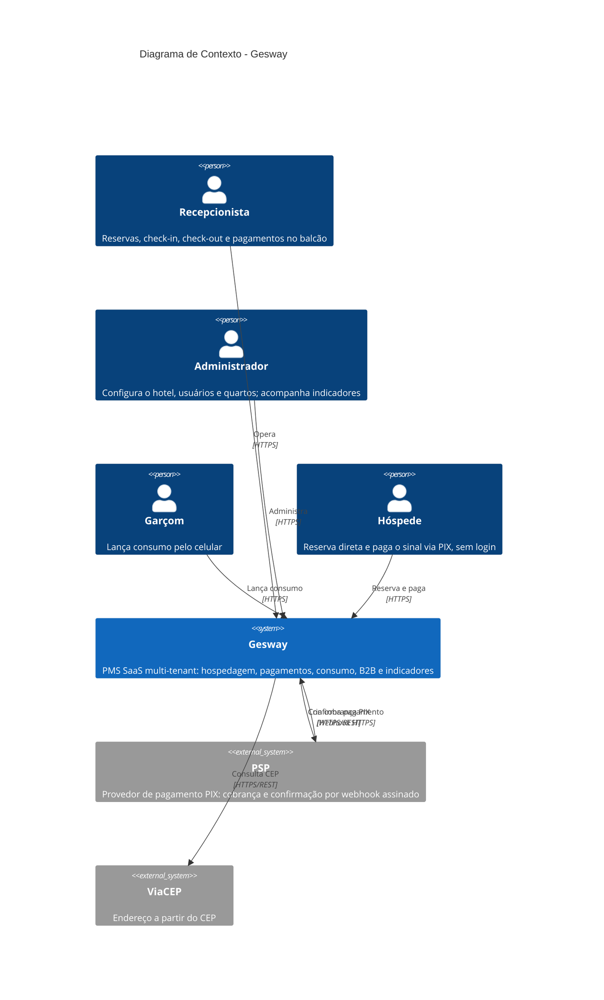
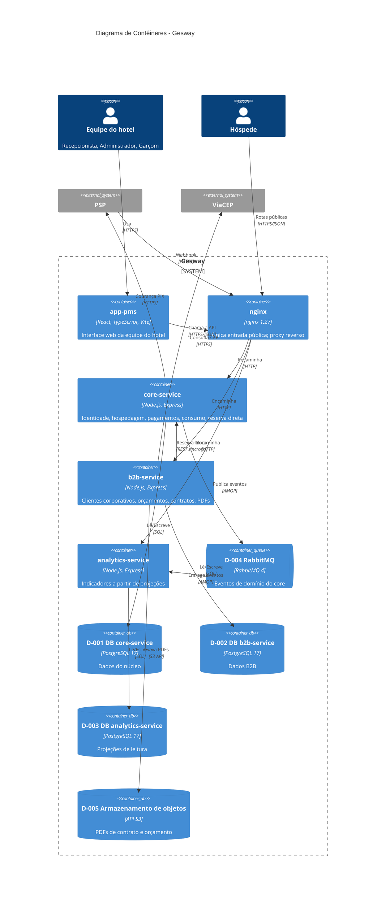
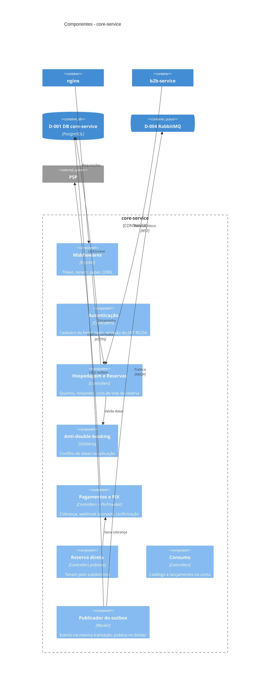
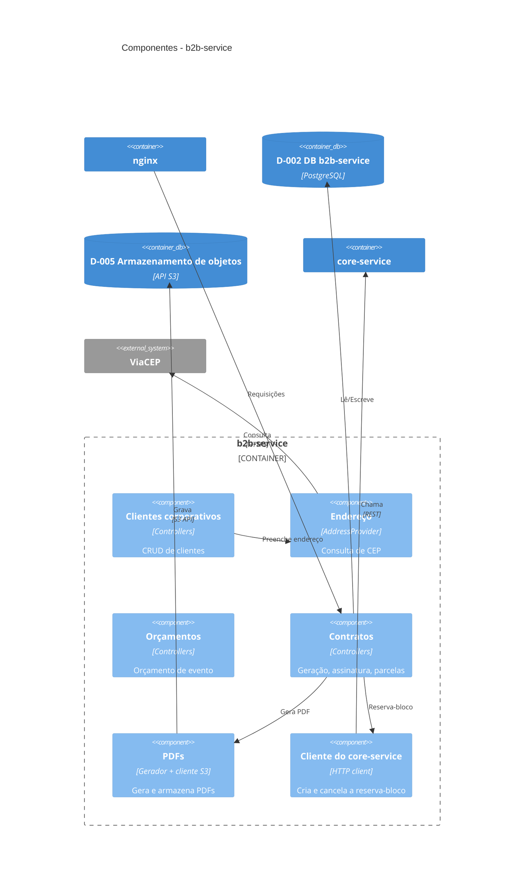
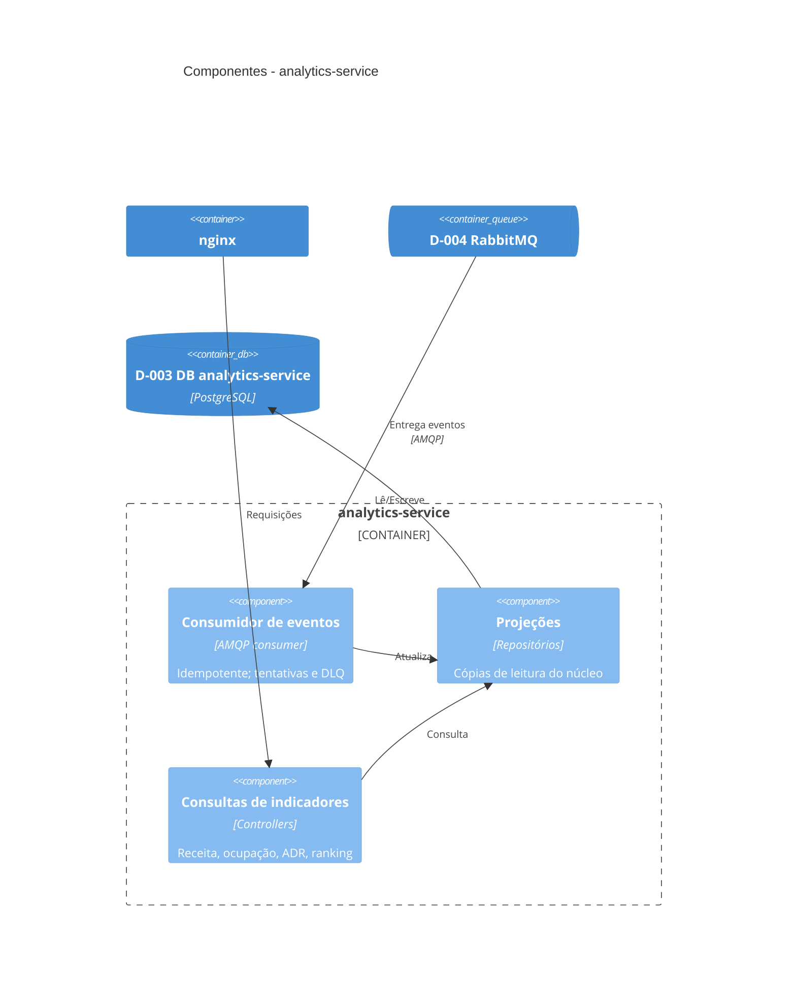

# Diagramas C4 Model

---

**Projeto:** Gesway — Sistema de Gestão Hoteleira (PMS SaaS) 
**Grupo:** Gesway — Gabriel Reis Cunha (6325149) 
· Sirlande Martins (6325269) 
· Weslley Lucas (6325226) 
**Data:** 07/10/2026 
**Versão:** 1.0

---

## 1. Objetivo

Este documento apresenta a arquitetura de software do Gesway pelo **C4 Model**, nos três níveis obrigatórios: Contexto, Contêineres e Componentes. O modelo detalha a arquitetura aos poucos, da interação com o mundo externo até os componentes internos de cada serviço.

**O documento é normativo.** Ele descreve a arquitetura-alvo do recorte em três serviços decidido na ADR-003, e não o estado atual do código. Componentes que ainda não foram construídos aparecem normalmente, sem marcação de status. O acompanhamento da execução é feito no Documento 08.

**Coerência com o Documento 03 (DFD).** O C4 e o DFD descrevem o mesmo sistema e usam os mesmos nomes:

- entidades externas: Hóspede, Operador do Hotel, PSP e ViaCEP;
- processos: `core-service`, `b2b-service` e `analytics-service`;
- armazenamentos: D-001 a D-005.

A única diferença é proposital. O "Operador do Hotel" do DFD aparece aqui dividido nos três papéis do sistema, porque cada papel usa o produto de um jeito diferente.

### Decisões de referência

Este documento depende de decisões registradas no Documento 07, que vem depois na ordem de entrega. Para que possa ser lido sozinho, o que ele usa de cada decisão está resumido abaixo.

| Decisão | O que este documento usa dela |
|---|---|
| **ADR-003** — recorte de serviços | Três serviços, delimitados por consistência transacional, cada um com o seu banco. `b2b-service → core-service` por REST síncrono, para criar e cancelar a reserva-bloco do contrato. `core-service → analytics-service` por eventos no RabbitMQ, com *outbox* transacional. O `analytics-service` não lê o banco do `core-service` |
| **ADR-004** — nuvem | AWS, com k3s em EC2. Os detalhes de infraestrutura ficam no Documento 05 |
| **ADR-006** — identidade entre serviços | O `core-service` é o **único emissor** de token (JWT RS256). Os outros serviços apenas verificam com a chave pública. Por isso não existe "Auth Service" separado, e o nginx não participa da validação de token |

---

## 2. Nível 1 — Diagrama de Contexto

Visão de alto nível: o Gesway como uma caixa-preta e suas interações com pessoas e sistemas externos.

### Descrição dos Elementos

| Elemento | Tipo | Descrição |
|----------|------|-----------|
| Recepcionista | Pessoa | Papel `RECEPTIONIST`. No balcão, durante o turno: reservas, check-in e check-out, pagamentos |
| Administrador | Pessoa | Papel `ADMIN`. Configura o hotel, os usuários e os quartos, e lê os indicadores |
| Garçom | Pessoa | Papel `WAITER`. Lança o consumo na conta do hóspede pelo celular |
| Hóspede | Pessoa | Sem login. Consulta disponibilidade, cria a reserva direta e paga o sinal via PIX pelas rotas públicas do hotel, identificado pelo subdomínio |
| Gesway | Sistema | PMS SaaS multi-tenant: cada hotel é um tenant isolado. Cobre hospedagem, pagamentos, consumo, clientes corporativos e indicadores |
| PSP | Sistema Externo | Processa a cobrança PIX e confirma o pagamento por *webhook* com assinatura. O hóspede paga no app do banco; quem avisa o Gesway é o PSP, não o hóspede |
| ViaCEP | Sistema Externo | Preenche o endereço no cadastro de cliente corporativo a partir do CEP |

O Gesway **não envia e-mail**, por isso o "Serviço de E-mail" do modelo não aparece. Notificação ao hóspede está registrada na ADR-003 como evolução fora do escopo.

---

## 3. Nível 2 — Diagrama de Contêineres

O sistema decomposto nos seus contêineres. Cada microsserviço é um contêiner.

### Descrição dos Contêineres

| Contêiner | Tecnologia | Responsabilidade | Porta |
|-----------|------------|------------------|-------|
| app-pms | React 18.3 + TypeScript 5.6, Vite 5.4, Tailwind 3.4 | Interface (SPA) da equipe do hotel: recepção, gerência e comanda do garçom. Não tem regra de negócio própria, toda validação fica no servidor | servido pelo nginx |
| nginx | nginx 1.27 | Única entrada pública. Faz proxy reverso para os serviços e limita a taxa de tentativas de login. **Não** valida token (ADR-006) e **não** expõe `/metrics` | 80/443 |
| core-service | Node.js 24 + Express 4.19, Sequelize 6 | Identidade e **único emissor de token**, hotéis, usuários, quartos, hóspedes, reservas, pagamentos e PIX, consumo e reserva direta. Publica os eventos de domínio | 3000 |
| b2b-service | Node.js 24 + Express | Clientes corporativos (com ViaCEP), orçamentos, contratos e parcelas, PDFs. Pede ao `core-service` a reserva-bloco do contrato | a definir (T-01.6) |
| analytics-service | Node.js 24 + Express | Receita, ocupação, diária média, alertas, sazonalidade, mix de pagamento e ranking, calculados a partir de projeções. Nunca lê o banco do core | a definir (T-01.4) |
| D-001 DB core-service | PostgreSQL 17 | Dados do núcleo. Garante o anti-*double-booking* no próprio banco (`EXCLUDE USING gist`) | 5432 |
| D-002 DB b2b-service | PostgreSQL 17 | Clientes corporativos, orçamentos e contratos | 5432 |
| D-003 DB analytics-service | PostgreSQL 17 | Projeções de leitura, alimentadas só por evento | 5432 |
| D-004 RabbitMQ | RabbitMQ 4 | Eventos do core para o analytics. *Exchange* `gesway.core.events`, com novas tentativas e fila de mensagens mortas no lado do consumidor | 5672 |
| D-005 Armazenamento de objetos | MinIO no cluster; S3 na nuvem (mesma API) | PDFs de contrato e de orçamento, num bucket privado. O download é feito por URL assinada de 5 minutos | 9000 |

**Bancos por serviço.** Cada serviço é dono do seu banco e só alcança o seu. D-001 a D-003 são **databases lógicos separados**, cada um com usuário próprio. Isso preserva o isolamento que a ADR-003 decidiu. Se ficam numa mesma instância PostgreSQL, por causa do free-tier, é decisão de infraestrutura e está no Documento 05.

**Linhas do modelo que não se aplicam:**

- **Auth Service:** a autenticação fica no `core-service` (ADR-006).
- **API Gateway** no sentido de Kong: o nginx é proxy reverso, sem autenticação.
- **Cache:** o Gesway não usa cache. Um Redis chegou a ser provisionado na infraestrutura, mas nenhum código o chama.

**Fora do escopo:** o site público de reservas com SSR (`app-booking`) e o backoffice de tenants (`app-admin`) têm a estrutura criada no monorepo, mas são pós-TCC. No escopo atual, o hóspede usa as rotas públicas da API pelo nginx.

---

## 4. Nível 3 — Diagrama de Componentes

Um diagrama por microsserviço, com os componentes e as relações principais.

### 4.1 Componentes do core-service

| Componente | Responsabilidade |
|---|---|
| Middlewares | Valida o token, carrega o tenant, que precisa estar ativo, confere o papel (RBAC) e aplica o CORS. Todo acesso a dado passa pelo `tenant_id` |
| Autenticação | Cadastro do hotel e login. Assina o JWT RS256 e é o único lugar do sistema que tem a chave privada |
| Usuários e Hotel | Usuários e papéis, e os dados do tenant (no diagrama, agrupados em Autenticação) |
| Hospedagem e Reservas | Categorias, quartos, hóspedes e o ciclo de vida da reserva, que segue a máquina de estados: `PENDING → CONFIRMED → CHECKED_IN → CHECKED_OUT`, e o cancelamento só a partir de `PENDING` ou `CONFIRMED` |
| Anti-*double-booking* | Confere conflito de datas na aplicação. A garantia final é do banco, pela constraint `EXCLUDE USING gist` |
| Pagamentos e PIX | Registro de pagamentos e cobrança PIX pela interface `PixProvider`, que tem um provedor simulado para testes e o Mercado Pago. O *webhook* exige assinatura, e o status é sempre confirmado no PSP antes de marcar o pagamento como pago |
| Reserva direta | Rotas públicas, sem login, em que o tenant é resolvido pelo subdomínio. Cria a reserva e a cobrança do sinal |
| Consumo | Catálogo de produtos e lançamentos na conta da hospedagem |
| Publicador do *outbox* | Grava o evento na mesma transação da mudança de estado e publica no RabbitMQ. Nenhum evento se perde se o broker estiver fora do ar |

### 4.2 Componentes do b2b-service

| Componente | Responsabilidade |
|---|---|
| Clientes corporativos | Cadastro das empresas que contratam eventos e hospedagem em bloco |
| Endereço | Preenche o endereço pelo CEP. Fica atrás da interface `AddressProvider`, com erros tipados, e os testes rodam sem rede |
| Orçamentos | Orçamento de evento, com confirmação e cancelamento |
| Contratos | Gera o contrato a partir do orçamento, cuida da assinatura, do cancelamento e das parcelas |
| PDFs | Gera os PDFs de contrato e de orçamento e os grava no armazenamento de objetos |
| Cliente do core-service | Pede ao core a criação e o cancelamento da reserva-bloco por REST síncrono. É a fronteira da ADR-003: a disponibilidade de quartos pertence ao core, então o b2b nunca grava reserva direto |

### 4.3 Componentes do analytics-service

| Componente | Responsabilidade |
|---|---|
| Consumidor de eventos | Consome a fila `analytics.core-events`. É idempotente, porque um evento repetido não soma duas vezes, e uma falha passa por novas tentativas com intervalo antes de ir para a fila de mensagens mortas |
| Projeções | Cópias de leitura dos dados do núcleo (hotéis, quartos, hóspedes, reservas, pagamentos), atualizadas só por evento. O hóspede eliminado a pedido do titular (LGPD) vira "Hóspede eliminado" sem perder o histórico dos indicadores |
| Consultas de indicadores | Receita, ocupação, diária média (ADR), alertas, sazonalidade, mix de pagamento e ranking, por tenant |

---

## 5. Decisões Arquiteturais (ADRs Resumidos)

| # | Decisão | Motivação | Alternativas Consideradas |
|---|---------|-----------|--------------------------|
| 1 | Node.js 24 + Express 4, módulos ESM | Conhecimento do time, e o mesmo runtime nos três serviços | — (ADR-001) |
| 2 | PostgreSQL 17 | O anti-*double-booking* fica garantido no próprio banco pela constraint `EXCLUDE USING gist`. A regra não depende só da aplicação | — (ADR-002) |
| 3 | Três serviços, recortados por consistência transacional, cada um com seu banco | O que precisa mudar junto fica no mesmo serviço. Os serviços evoluem e falham isolados | Recorte por tipo de dado; monólito modular (ADR-003) |
| 4 | Assíncrono por RabbitMQ com *outbox* do core para o analytics; síncrono por REST do b2b para o core | Indicadores toleram atraso. A reserva-bloco do contrato não tolera, então precisa de resposta imediata | SQS; Redis Streams (ADR-003) |
| 5 | AWS, k3s em EC2, ciclo efêmero (sobe na sessão, destrói ao final) | Custo dentro do free-tier. O EKS cobra o control plane mesmo parado | EKS (ADR-004) |
| 6 | Docker + Kubernetes (k3s), com Docker Compose de contingência | Mesmo artefato em todos os ambientes, e plano B para a defesa sem nuvem | — (ADR-005) |
| 7 | JWT RS256, com o core como único emissor | Os outros serviços verificam o token sem conseguir emitir um | HS256 com segredo compartilhado (ADR-006) |
| 8 | Provedores externos atrás de interface (`PixProvider`, `AddressProvider`) | Troca de provedor sem mudar controller, e testes sem rede | Chamada direta ao SDK do provedor |

---

## 6. Tecnologias Utilizadas

| Camada | Tecnologia | Versão | Justificativa |
|--------|------------|--------|---------------|
| Frontend | React + TypeScript | 18.3 / 5.6 | SPA tipada; o contrato da API é gerado do Swagger |
| Build e estilo | Vite, Tailwind CSS | 5.4 / 3.4 | Build rápido; design system próprio em `packages/ui` |
| Estado no cliente | TanStack Query, Zustand | 5 / 5 | Cache de servidor separado de estado local |
| Backend | Node.js + Express | 24 / 4.19 | Mesmo runtime nos três serviços |
| ORM | Sequelize | 6.37 | Transações explícitas nas operações que tocam várias tabelas |
| Banco Relacional | PostgreSQL | 17 | Constraint de exclusão para o anti-*double-booking* |
| Banco NoSQL | — | — | Não utilizado: o domínio é relacional e transacional |
| Cache | — | — | Não utilizado: nenhuma consulta exigiu cache até aqui |
| Mensageria | RabbitMQ | 4 | ADR-003; fila de mensagens mortas nativa |
| Armazenamento de objetos | MinIO / S3 | API S3 | O mesmo SDK local e na nuvem; trocar de um para o outro é só configuração |
| Proxy | nginx | 1.27 | Entrada única e limite de taxa no login |
| Monitoramento | Prometheus + Grafana | 3.1 / 11.4 | Requisito obrigatório; métricas por endpoint e por tenant |
| IaC | Terraform | — | Requisito obrigatório |
| CI/CD | GitHub Actions | — | Requisito obrigatório; portão de cobertura de 60% |
| Containerização | Docker, k3s | — | Padronização do deploy; k3s pela ADR-004 |

---

## 7. Histórico de Revisões

| Versão | Data | Autor | Descrição da Alteração |
|--------|------|-------|------------------------|
| 1.0 | 07/10/2026 | Weslley Lucas | Versão inicial: três níveis para os três serviços da ADR-003, nomes alinhados ao Documento 03 |

---

**Aprovado por:**

___________________________________________________
Professor(a) Orientador(a)

Data: ___/___/2026
