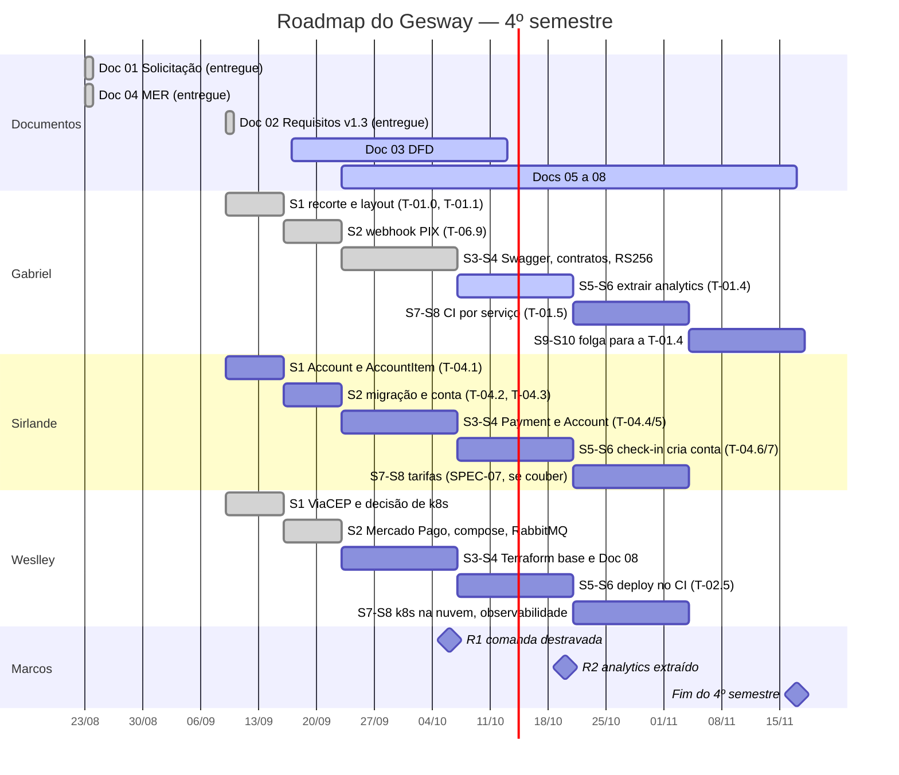

# Planejamento de Sprints e Tarefas

---

**Projeto:** Gesway — Sistema de Gestão Hoteleira (PMS SaaS) 
**Grupo:** Gesway — Gabriel Reis Cunha (6325149) 
· Sirlande Martins (6325269) 
· Weslley Lucas (6325226) 
**Metodologia:** Kanban por trilhas, com cadência semanal 
**Duração da Sprint:** 1 semana 
**Data de Início:** 09/09/2026 
**Data de Término Prevista:** 17/11/2026 (4º semestre) 
**Versão:** 1.0

---

## 1. Objetivo

Este documento apresenta o planejamento de desenvolvimento do Gesway organizado em sprints semanais, com as tarefas, os responsáveis, as estimativas e os critérios de conclusão. Cobre o 4º semestre em detalhe e o 5º semestre em linhas gerais. É atualizado a cada sprint.

**É também o registro de execução do projeto.** O Documento 02 aponta este documento como o lugar onde fica o acompanhamento da execução. Por isso, além do plano, a Seção 5 registra o que de fato aconteceu em cada sprint, com a evidência no repositório.

**Fonte das tarefas.** Os identificadores `T-xx.y` são os das especificações do projeto (`docs/specs/SPEC-01` a `SPEC-07`, no repositório do hotel). Cada especificação tem critérios de aceite verificáveis, e são eles o critério de conclusão de cada tarefa.

---

## 2. Membros da Equipe e Papéis

O time trabalha em **três trilhas paralelas**, uma por pessoa. Cada trilha tem backend, frontend e documentos próprios, divididos por afinidade: quem constrói a API constrói a tela dela.

| # | Nome | RA | Papel Principal | Papéis Secundários |
|---|------|-----|-----------------|-------------------|
| 1 | Gabriel Reis Cunha | 6325149 | Tech Lead e arquiteto — SPEC-01 Microsserviços | Portão de QA de todas as frentes · correções de segurança (SPEC-06) · frontend de Reservas, Rack e Painel do dia · Documentos 01 e 02 |
| 2 | Sirlande Martins | 6325269 | Backend de domínio — SPEC-04 Consumo (comanda) | Dona de `db/schema.sql` e dos Models · SPEC-06 (T-06.10, T-06.11) · frontend de Comanda e Ficha do hóspede · Documentos 03 e 04 |
| 3 | Weslley Lucas | 6325226 | DevOps — SPEC-02 Cloud, IaC e Observabilidade | SPEC-03 Integrações · dono do CI e de `infra/` · docker-compose de contingência · frontend de Financeiro, Fechamento de caixa, B2B e Configurações · Documentos 05 a 08 |

**Onde as trilhas se tocam.** São dois pontos de encontro, e quem conclui a tarefa avisa os outros:

- **R1:** quando a T-04.3 (Sirlande) fecha a conta da hospedagem, a comanda no frontend fica liberada.
- **R2:** quando a T-01.4 (Gabriel) extrai o `analytics-service` com RabbitMQ, ficam liberadas a T-02.3 (Weslley) e a versão final dos Documentos 03 e 06.

Fora desses pontos, a única colisão é por arquivo compartilhado, e cada arquivo tem um dono:

| Arquivo | Dono |
|---|---|
| `.github/workflows/` | Weslley; o Gabriel entrega o que precisa e o Weslley integra |
| `db/schema.sql` e os Models | Sirlande; o Gabriel avisa antes de mexer |
| `infra/` e `docker-compose.yml` | Weslley |

---

## 3. Visão Geral do Cronograma

### 3.1 Roadmap por Semestre

### 3.2 O que cada semestre entrega

| Semestre | Entrega |
|---|---|
| **4º (2026/2)** | Os 8 documentos. O critério de microsserviços do Termo, ou seja, pelo menos dois serviços rodando separados e se comunicando: `core-service` e `analytics-service` via RabbitMQ (T-01.4). Integração com API externa real (ViaCEP e Mercado Pago). Docker Compose de contingência. Cobertura de testes ≥ 60% com portão no CI |
| **5º (2027/1)** | O `b2b-service` extraído (T-01.6). Infraestrutura na AWS provisionada por Terraform, deploy automatizado no CI, Prometheus e Grafana no cluster, e a defesa na banca. As datas seguem o calendário acadêmico, ainda não publicado |

---

## 4. Product Backlog Priorizado

### Legenda de Prioridade
- **P0** — Crítico: critério do Termo de Aceite, ou bloqueia outras tarefas
- **P1** — Alta (necessário para o MVP)
- **P2** — Média (necessário para a entrega final)
- **P3** — Baixa: buffer, entra só se o cronograma permitir

### Estimativa

O time estima em **dias de desenvolvimento** (dias-dev), não em story points, porque é a unidade em que cada um consegue comparar o plano com a própria agenda de estudo. O escopo total do 4º semestre é de **~111 dias-dev**, cerca de 37 por pessoa. A estimativa está por épico (especificação), que é a granularidade em que o time planeja. As tarefas com estimativa própria na especificação aparecem com ela.

| Épico | Tema | Prioridade | Estimativa | Responsável |
|---|---|---|---|---|
| SPEC-01 | Microsserviços | P0 | ~14 dias | Gabriel |
| SPEC-02 | Cloud, IaC e Observabilidade | P0 | ~12 dias | Weslley |
| SPEC-03 | Integrações com APIs externas | P0 | ~6 dias | Weslley |
| SPEC-04 | Módulo de Consumo (comanda) | P1 | ~17 dias | Sirlande |
| SPEC-05 | Frontend `app-pms` | P1 | ~35 dias | os três, por módulo |
| SPEC-06 | Qualidade e dívida técnica | P1 | ~10 dias | os três, por fatia |
| SPEC-07 | Tarifas por período | P3 | ~12 dias | Sirlande |
| Documentos | Os 8 documentos oficiais | P0 | ~5 dias | por documento |

### Backlog Completo

Status em 07/10/2026: ✅ concluída · 🟡 em andamento ou em revisão · 🔲 não iniciada.

| ID | Épico | Tarefa | Prioridade | Estimativa | Responsável | Sprint | Status |
|----|-------|--------|------------|------------|-------------|--------|--------|
| T-01.0 | SPEC-01 | Reorganizar o repositório em layout de serviços | P0 | — | Gabriel | S1 | ✅ |
| T-01.1 | SPEC-01 | Decidir o recorte e a propriedade dos dados (ADR-003) | P0 | — | Gabriel | S1 | ✅ |
| T-01.2 | SPEC-01 | Definir o padrão de comunicação e o catálogo de eventos | P0 | — | Gabriel | S3–S4 | 🟡 |
| T-01.3 | SPEC-01 | Autenticação entre serviços — JWT RS256 (ADR-006) | P0 | — | Gabriel | S3–S4 | 🟡 |
| T-01.4 | SPEC-01 | Extrair o `analytics-service` com RabbitMQ e *outbox* | P0 | reestimar | Gabriel | S5–S6 | 🔲 |
| T-01.5 | SPEC-01 | CI/CD por serviço | P1 | — | Gabriel | S7–S8 | 🔲 |
| T-01.6 | SPEC-01 | Extrair o `b2b-service` | P2 | — | Gabriel | 5º sem. | 🔲 |
| T-02.1 | SPEC-02 | Decidir o serviço de Kubernetes e dimensionar o custo | P0 | — | Weslley | S1 | 🟡 |
| T-02.2 | SPEC-02 | Módulos Terraform da infraestrutura base | P0 | — | Weslley | S3–S4 | 🔲 |
| T-02.5 | SPEC-02 | Deploy automatizado no CI | P1 | — | Weslley | S5–S6 | 🔲 |
| T-02.3 | SPEC-02 | Portar os manifests Kubernetes para a nuvem | P0 | — | Weslley | S7–S8 | 🔲 |
| T-02.4 | SPEC-02 | Stack de observabilidade (Prometheus + Grafana) | P0 | — | Weslley | S7–S8 | 🟡 |
| T-03.1 | SPEC-03 | Integração ViaCEP | P0 | meio dia | Weslley | S1 | ✅ |
| T-03.2 | SPEC-03 | Integração Mercado Pago (sandbox) | P0 | 2 a 3 dias | Weslley | S2 | 🟡 |
| T-03.3 | SPEC-03 | Registrar a decisão de integrações como ADR | P1 | — | Weslley | S5–S6 | 🔲 |
| T-04.1 | SPEC-04 | `Account` e `AccountItem` | P1 | — | Sirlande | S1 | 🔲 |
| T-04.2 | SPEC-04 | Migração do dado financeiro para a conta | P1 | — | Sirlande | S2 | 🔲 |
| T-04.3 | SPEC-04 | Conta da hospedagem (R1) | P1 | — | Sirlande | S2 | 🔲 |
| T-04.4 | SPEC-04 | `Payment ↔ Account` | P1 | — | Sirlande | S3–S4 | 🔲 |
| T-04.5 | SPEC-04 | Delegação de lançamento | P1 | — | Sirlande | S3–S4 | 🔲 |
| T-04.6 | SPEC-04 | Check-in cria a conta | P1 | — | Sirlande | S5–S6 | 🔲 |
| T-04.7 | SPEC-04 | Fechamento da SPEC-04 | P1 | — | Sirlande | S5–S6 | 🔲 |
| T-06.2 | SPEC-06 | Schema de resposta no Swagger | P1 | — | Gabriel | S2 | ✅ |
| T-06.3 · T-06.6 | SPEC-06 | Índice único parcial nos models com exclusão lógica | P1 | — | Sirlande (revisão) | S1–S2 | 🟡 |
| T-06.4 | SPEC-06 | Docker Compose de contingência da defesa | P0 | — | Weslley | S2 | ✅ |
| T-06.5 | SPEC-06 | Endpoint público vazando dados de pagamento | P0 | — | Gabriel | S2 | ✅ |
| T-06.8 | SPEC-06 | Promover `develop` para `main` | P1 | — | Gabriel | S1 | ✅ |
| T-06.9 | SPEC-06 | Assinatura no webhook PIX | P0 | — | Gabriel | S2 | ✅ |
| T-06.10 | SPEC-06 | Paginação | P2 | — | Sirlande | a definir | 🔲 |
| T-06.11 | SPEC-06 | Eliminação de dado pessoal a pedido do titular (LGPD) | P1 | — | Sirlande | a definir | 🔲 |
| SPEC-05 | SPEC-05 | Frontend — Fase 0 completa; Fases 1 e 2 por módulo | P1 | ~35 dias | os três | S3–S10 | 🟡 |
| SPEC-07 | SPEC-07 | Tarifas por período | P3 | ~12 dias | Sirlande | S7–S8, se couber | 🔲 |
| DOC-01 | Documentos | Solicitação do Sistema | P0 | — | Gabriel | — | ✅ entregue 23/08 |
| DOC-02 | Documentos | Requisitos RF/RNF | P0 | — | Gabriel | S1 | ✅ v1.3 entregue 09/09 |
| DOC-03 | Documentos | DFD | P0 | — | Sirlande | S2–S5 | 🟡 v1.2 em entrega |
| DOC-04 | Documentos | MER | P0 | — | Sirlande | — | ✅ entregue 23/08 |
| DOC-05 | Documentos | Arquitetura em Nuvem | P0 | — | Weslley | S7–S8 | 🔲 |
| DOC-06 | Documentos | C4 Model | P0 | — | Weslley | S7–S8 | 🟡 rascunho 07/10 |
| DOC-07 | Documentos | ADRs | P0 | — | Weslley | S3–S8 | 🟡 ADR-003 escrita, ADR-006 aprovada |
| DOC-08 | Documentos | Planejamento de Sprints | P0 | — | Weslley | S3–S4 | 🟡 este documento |

---

## 5. Detalhamento por Sprint

Em cada sprint, a tabela traz o que foi planejado. O **registro** logo abaixo traz o que de fato aconteceu, com a evidência no repositório do hotel.

### Sprint 1 — Recorte, layout e primeiras integrações

| Informação | Detalhe |
|------------|---------|
| **Período** | 09/09 a 15/09 |
| **Objetivo** | Decidir o recorte dos serviços, reorganizar o repositório para ele e tirar do vermelho o critério de integração externa |
| **Capacidade** | ~11 dias-dev (3 pessoas) |

| ID | Tarefa | Responsável | Estimativa | Critério de Conclusão (DoD) |
|----|--------|-------------|----|-----------------------------|
| T-01.1 | Recorte dos serviços | Gabriel | — | ADR-003 escrita; SPEC-01 atualizada |
| T-01.0 | Layout de serviços | Gabriel | — | Backend em `services/core-service/`, k8s em `infra/k8s/` |
| T-04.1 | `Account` e `AccountItem` | Sirlande | — | CA-04.1 da SPEC-04 |
| T-03.1 | ViaCEP | Weslley | meio dia | `GET /address/:cep` com testes sem rede |
| T-02.1 | Decidir Kubernetes e custo | Weslley | — | Decisão com custo estimado e ciclo de vida definido |

**Registro:** a T-01.1 fechou com a ADR-003, a T-01.0 com o PR #77, e a T-06.8 saiu antecipada no PR #76. O ViaCEP entrou na `develop` em 16/09 (`00c2fee`). A T-02.1 foi decidida: k3s em EC2, não EKS. **Falta transcrever a ADR-004.** A T-04.1 não teve avanço.

---

### Sprint 2 — Segurança do pagamento e contingência

| Informação | Detalhe |
|------------|---------|
| **Período** | 16/09 a 22/09 |
| **Objetivo** | Fechar as falhas de segurança no fluxo de pagamento, integrar o PSP real e garantir que o sistema sobe sem nuvem |
| **Capacidade** | ~11 dias-dev |

| ID | Tarefa | Responsável | Estimativa | Critério de Conclusão (DoD) |
|----|--------|-------------|----|-----------------------------|
| T-06.9 | Assinatura no webhook PIX | Gabriel | — | Webhook sem assinatura válida recusado (fail-closed) |
| T-04.2 · T-04.3 | Migração financeira e conta | Sirlande | — | Contagem antes e depois da migração confere |
| T-03.2 | Mercado Pago | Weslley | 2 a 3 dias | Cobrança real no sandbox e webhook validado |
| T-06.4 | Docker Compose de contingência | Weslley | — | `docker compose up` sobe tudo e `migrate` roda |
| — | RabbitMQ no cluster | Weslley | — | Broker provisionado em `infra/k8s/` |

**Registro:**

- **Concluídos:** T-06.5 (PR #78), T-06.9 (PR #81) e T-06.2 (PR #83, antecipada). O Doc 03 v1.0 foi escrito em 17/09.
- **T-06.4:** feita e validada de ponta a ponta, mergeada em 24/09 (PR #79). Fecha o critério 20 do Termo.
- **RabbitMQ:** provisionado, mas ainda sem publicação nem consumo, que chegam com a T-01.4.
- **T-03.2:** implementada e auditada na branch, mas não mergeada.
- **T-04.2 e T-04.3:** sem avanço.

---

### Sprint 3 e Sprint 4 — Contratos entre serviços e base da nuvem

| Informação | Detalhe |
|------------|---------|
| **Período** | 23/09 a 06/10 |
| **Objetivo** | Definir como os serviços conversam e se autenticam, e preparar a infraestrutura como código |
| **Capacidade** | ~22 dias-dev |

| ID | Tarefa | Responsável | Estimativa | Critério de Conclusão (DoD) |
|----|--------|-------------|----|-----------------------------|
| T-01.2 | Catálogo de eventos | Gabriel | — | Eventos, envelope e política de falhas aprovados |
| T-01.3 | RS256 | Gabriel | — | Core assina; boot recusa par de chaves inválido |
| T-04.4 · T-04.5 | `Payment ↔ Account` | Sirlande | — | Branch isolada, revisão em dupla |
| T-02.2 | Terraform base | Weslley | — | `plan` limpo, `apply` idempotente, `destroy` sem órfão |
| DOC-08 | Planejamento de sprints | Weslley | — | Este documento |

**Registro:**

- **T-01.3:** RS256 mergeado (PR #84, 28/09) e as ressalvas do QA corrigidas (PR #86, 04/10).
- **T-01.2:** catálogo de eventos aprovado (PR #87, 04/10).
- **Documentos:** os insumos dos Docs 05 e 06 foram publicados em 28/09, e o Doc 03 recebeu a v1.2.
- **T-02.2 não começou.** A decisão de 16/09 previa uma fase em `t3.small`, que fica fora do free-tier, e a regra do projeto não permite. A escolha entre conferir a elegibilidade no console, usar dois `t3.micro` ou reduzir o que roda no nó precisa vir antes de qualquer Terraform.
- **T-04.4 e T-04.5:** sem avanço registrado.

---

### Sprint 5 — Extração do analytics *(em andamento)*

| Informação | Detalhe |
|------------|---------|
| **Período** | 07/10 a 13/10 |
| **Objetivo** | Primeiro serviço extraído e falando por evento, e fechar as pendências de integração |
| **Capacidade** | ~11 dias-dev |

| ID | Tarefa | Responsável | Estimativa | Critério de Conclusão (DoD) |
|----|--------|-------------|----|-----------------------------|
| T-01.4 | Extrair o `analytics-service` | Gabriel | reestimar | Dois processos, comunicação por RabbitMQ, *outbox* no core |
| T-04.6 · T-04.7 | Check-in cria conta | Sirlande | — | CA-04.6 e CA-04.7 |
| T-03.2 | Fechar o Mercado Pago | Weslley | — | Merge, e validação no sandbox real |
| T-02.5 | Deploy no CI | Weslley | — | Push em `main` publica a imagem e faz o deploy |

**Registro parcial (07/10):**

- **T-03.2:** com a `develop` integrada, um achado de risco financeiro corrigido e o PR #89 aberto. Falta a validação no sandbox.
- **T-02.4:** a parte local foi antecipada: `/metrics` protegido, Prometheus e Grafana no compose e no k8s, e dashboard. Está na branch `feature/metrics`.
- **PR #80:** o documento de conformidade foi recontado, ficando em 9 critérios atendidos, 4 parciais e 7 não atendidos.
- **Documentos:** escritos os rascunhos dos Docs 06 e 08.

---

### Sprint 6 a Sprint 10 — Planejadas

| Sprint | Período | Gabriel | Sirlande | Weslley |
|---|---|---|---|---|
| S6 | 14/10 a 20/10 | T-01.4 (continua) · **R2** | T-04.6 · T-04.7 | T-02.5 · T-03.3 |
| S7 | 21/10 a 27/10 | T-01.5 — CI por serviço | SPEC-07, se couber · T-06.10 e T-06.11 a encaixar | T-02.3 · T-02.4 · Docs 05 e 06 |
| S8 | 28/10 a 03/11 | T-01.5 | SPEC-07, se couber | T-02.3 · T-02.4 · Docs 05 e 06 |
| S9 | 04/11 a 10/11 | Folga para a T-01.4 | — | Doc 07 · revisão dos documentos |
| S10 | 11/11 a 17/11 | Estabilização e entrega | Estabilização e entrega | Estabilização e entrega |

**Resultado esperado ao fim da S10:** os 8 documentos entregues e dois serviços rodando separados e se comunicando, que é o critério de microsserviços do Termo. A contingência via Docker Compose deve estar pronta para a demonstração.

---

## 6. Cerimônias Ágeis

| Cerimônia | Frequência | Duração | Registro |
|-----------|-----------|---------|----------|
| Planejamento | Semanal, na reunião do time | 30 min | Este documento — grade da Seção 5 |
| Acompanhamento | Contínuo, assíncrono | — | `bash scripts/estado.sh` mostra o estado real do repositório. **Bloqueio não espera a reunião**: quem travou avisa no mesmo dia |
| Revisão | Semanal, na mesma reunião | 15 min | Registro da sprint na Seção 5, com evidência |
| Retrospectiva | Semanal, na mesma reunião | 15 min | Ajustes na grade e na ordem de corte |
| Encontro com o orientador | Conforme o calendário | — | Ficha de registro de encontro, no repositório da UniFAAT |

**Pauta fixa da reunião semanal:**

1. O que fechou?
2. O que está travando?
3. O que vai colidir na semana seguinte?
4. Alguma especificação mudou?
5. Revisão dos componentes novos do design system.

---

## 7. Definition of Done (DoD) Global

Uma tarefa só é considerada **concluída** quando atende a TODOS os critérios abaixo:

- [ ] Critérios de aceite da especificação (`CA-xx.y.z`) atendidos e marcados na própria especificação
- [ ] Testes escritos e passando; cobertura global ≥ 60%, com portão no CI
- [ ] Auditoria do `qa-redteam` registrada em `docs/qa/`, porque ninguém audita o próprio código. Revisão humana adicional onde o erro é irreversível: dado financeiro, pagamento, recurso de nuvem com custo e promoção para `main`
- [ ] CI passando (testes e `scripts/qa_checks.sh`)
- [ ] Toda consulta nova filtra por `tenant_id`; operação que altera duas ou mais tabelas usa transação
- [ ] Documentação e especificação atualizadas
- [ ] Merge em `develop`, a partir de uma branch `feature/*` ou `fix/*`, nunca commit direto
- [ ] Relatório de sessão em `docs/historico_sessao/<dev>/`

---

## 8. Métricas de Acompanhamento

| Métrica | Como Medir | Meta |
|---------|-----------|------|
| Tarefas concluídas por sprint | Status da Seção 4 contra a grade da Seção 5 | Grade cumprida ou replanejada na mesma semana |
| Commits por integrante | `git log --since` por autor | Ao menos 1 por semana por integrante — exigência do Termo no 5º semestre |
| Cobertura de Testes | `npm run test:coverage`, com portão no CI | ≥ 60% de linhas (hoje 77%) |
| Critérios do Termo | Análise de conformidade | Os 20 atendidos até a defesa |
| Lead time de branch | Data do primeiro commit até o merge em `develop` | Branch não fica mais de uma sprint sem merge |

---

## 9. Ferramentas de Gestão

| Finalidade | Ferramenta |
|-----------|------------|
| Board de tarefas | Especificações em `docs/specs/` (status por tarefa e por critério de aceite) e `scripts/estado.sh` |
| Comunicação | [canal do grupo — confirmar] e reunião semanal |
| Repositório | GitHub (`gabrielreis354/sistema_hotel_prova`) |
| Documentação | Markdown no próprio repositório; documentos oficiais no fork da UniFAAT |
| CI/CD | GitHub Actions |
| Qualidade | `qa-redteam` (auditoria por branch) e `scripts/qa_checks.sh` |

---

## 10. Riscos e Mitigações

| Risco | Probabilidade | Impacto | Mitigação |
|-------|--------------|---------|-----------|
| T-01.4 maior que o previsto, por causa do RabbitMQ e do *outbox* | Alta | Alto | Reestimada; S9–S10 do Gabriel são folga para ela. Catálogo de eventos já aprovado |
| Escopo não caber até a entrega | Alta | Alto | Ordem de corte declarada de antemão: 1) SPEC-07; 2) T-05.9 a T-05.12; 3) parar a SPEC-04 na T-04.3, que é ponto de parada seguro |
| Custo de nuvem sair do free-tier | Média | Alto | Regra absoluta do projeto: nunca provisionar fora do free-tier, sem exceção por valor. Ciclo efêmero (`apply` na sessão, `destroy` ao final) e nunca o usuário `root` |
| Trilhas com pouco avanço registrado | Alta | Alto | Na `develop`, desde 16/09: 62 commits do Gabriel, 9 do Weslley e 2 do Sirlande — sem contar branches ainda não mergeadas. Retomar pelas tarefas sem bloqueio e cobrar a cadência semanal |
| Branch envelhecer sem merge | Média | Médio | Merge da `develop` antes de fechar; T-03.2 e T-06.3/T-06.6 ficaram mais de duas semanas paradas |
| Rede indisponível no dia da defesa | Baixa | Alto | Docker Compose de contingência (T-06.4) sobe o sistema inteiro localmente |
| API externa fora do ar | Baixa | Médio | Provedores atrás de interface, com provedor simulado; testes não dependem de rede |

---

## 11. Histórico de Revisões

| Versão | Data | Autor | Descrição da Alteração |
|--------|------|-------|------------------------|
| 1.0 | 07/10/2026 | Weslley Lucas | Versão inicial: planejamento das sprints S1 a S10 e registro de execução das sprints S1 a S4 e do início da S5 |

---

**Aprovado por:**

___________________________________________________
Professor(a) Orientador(a)

Data: ___/___/2026
